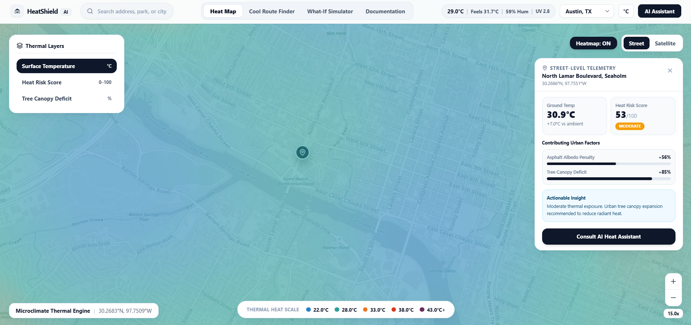
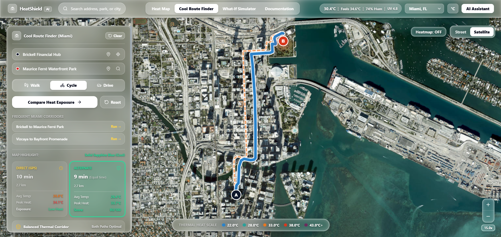
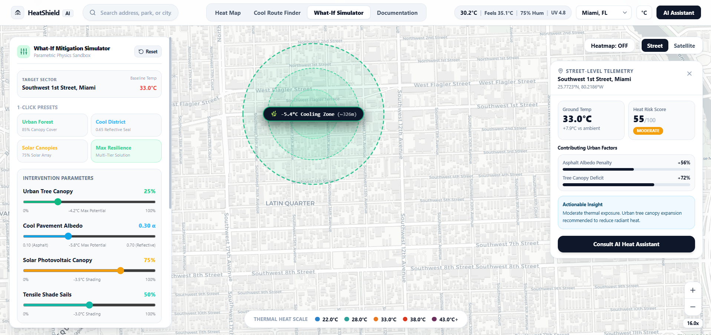
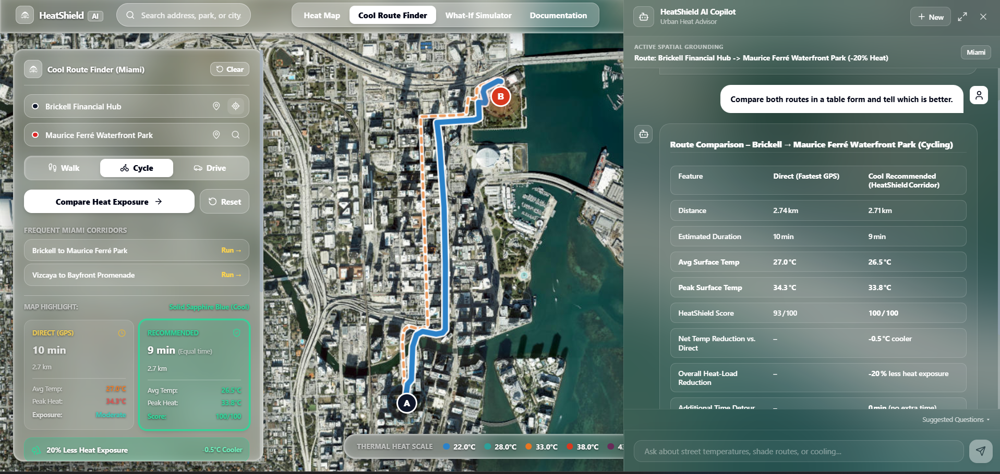
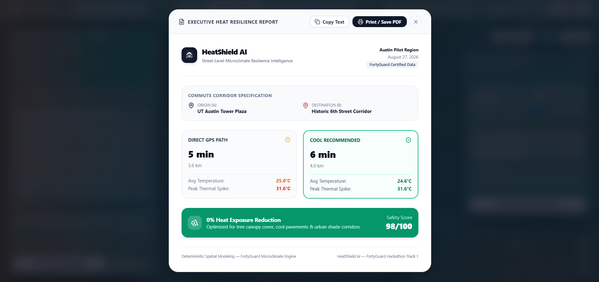
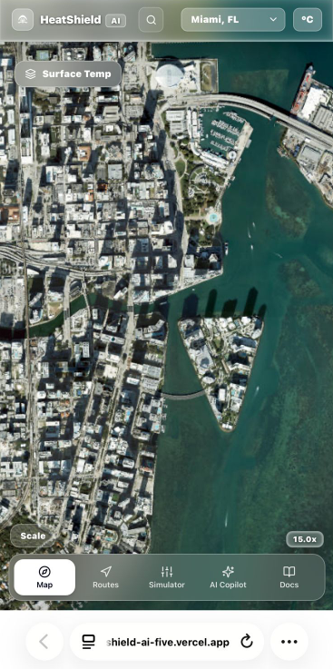

# HeatShield AI — Street-Level Urban Microclimate Intelligence

> **FortyGuard Hackathon 2026 — Track 1: Resilient Cities & Infrastructure**  
> **Framework:** Detect → Understand → Avoid → Reduce → Report  
> **Deployment:** Production Ready on Vercel  
> **Repository:** https://github.com/abdi219/HeatShield-AI  

---

## Special Acknowledgement & Shoutout to FortyGuard

A huge thank you to **FortyGuard** for hosting the Hackathon 2026 and providing access to hyper-local, street-level temperature datasets and APIs. 

Traditional meteorological tools only provide broad regional forecasts from distant airport stations. FortyGuard's groundbreaking street-level spatial intelligence makes it possible to visualize true microclimate disparities, enabling developers and urban innovators to build real-world climate resilience tools that protect pedestrians, optimize city planning, and save lives.

*Special thanks also to **CARTO Basemaps** for providing official basemap API licensing for high-performance, watermark-free cartographic street rendering.*

---

## Table of Contents

1. [Executive Summary](#executive-summary)
2. [Hackathon Development Sprint Timeline](#hackathon-development-sprint-timeline)
3. [Interactive Feature Showcase](#interactive-feature-showcase)
4. [The Connected Ecosystem (How Features Work Together)](#the-connected-ecosystem-how-features-work-together)
5. [Platform Feature Matrix](#platform-feature-matrix)
6. [Technical Architecture & Equations](#technical-architecture--equations)
7. [FortyGuard API Integration & Proof](#fortyguard-api-integration--proof)
8. [Official Architecture & Documentation Index](#official-architecture--documentation-index)
9. [Repository Directory Structure](#repository-directory-structure)
10. [Future Roadmap & Planned Innovations](#future-roadmap--planned-innovations)
11. [Known Limitations & Technical Notes](#known-limitations--technical-notes)
12. [Local Setup & Quick Start Guide](#local-setup--quick-start-guide)
13. [Environment Variable Configuration](#environment-variable-configuration)
14. [Security & Key Isolation Policy](#security--key-isolation-policy)
15. [Technology Stack & Dependencies](#technology-stack--dependencies)
16. [Hackathon Submission Details](#hackathon-submission-details)

---

## Executive Summary

Urban Heat Islands (UHIs) cause street-level temperatures to fluctuate by as much as **8°C to 15°C (14°F to 27°F)** within the same neighborhood. An unshaded black asphalt intersection can be dangerously hot, while a tree-shaded sidewalk 100 meters away remains comfortable.

**HeatShield AI** is an urban microclimate intelligence platform powered by **FortyGuard street-level thermal data**. Built for **Track 1: Resilient Cities & Infrastructure**, it empowers citizens, urban planners, and municipal agencies to:
1. **Detect:** Visualize continuous, hyper-local surface temperature variations across city blocks.
2. **Understand:** Translate raw temperatures and canopy deficits into a unified **Heat Risk Score (0–100 HRS)**.
3. **Avoid:** Find cooler walking paths with an automated **Cool Route Finder** that balances travel time against heat exposure.
4. **Reduce:** Model cooling interventions using an interactive **What-If Urban Mitigation Simulator** (tree canopy, high-albedo cool pavements, solar/shade canopies).
5. **Report:** Generate printable, executive-ready PDF resilience summaries.

---

## Hackathon Development Sprint Timeline

The HeatShield AI platform was built during the FortyGuard Hackathon 2026 sprint. The timeline below documents the chronological progression and commit milestones:

| Date & Phase | Milestone | Key Technical Deliverables & Commit Highlights |
| :--- | :--- | :--- |
| **Aug 17, 2026**<br>*(Day 0 — Initial Commit)* | **M1: Architecture Foundation & Scaffolding** | Initial repository commit; structured Next.js 14 App Router, TypeScript data contracts, glassmorphic UI design tokens, Turf.js spatial calculation foundation, and initial Leaflet Canvas 2D engine setup. |
| **Aug 18, 2026**<br>*(Day 1 — Hackathon Kickoff)* | **M2: Official FortyGuard API Key Integration** | Hackathon officially commenced; received and integrated official **FortyGuard Temperature API credentials** into secure server-side Route Handlers (`/api/heat/location`, `/api/heat/grid`), connecting live hyper-local 30m grid data ingestion. |
| **Aug 19–21, 2026**<br>*(Days 2–4)* | **M3–M4: Microclimate Heatmap & Cool Route Engine** | Formulated polyline heat-sampling algorithm, OSRM real street network snapping, HeatShield Route Safety Score (HSS), automatic reverse-geocoding, and responsive SVG thermal elevation profile. |
| **Aug 22–24, 2026**<br>*(Days 5–7)* | **M5–M6: What-If Simulator & Grounded AI Copilot** | Developed parametric What-If Mitigation Simulator (canopy evapotranspiration, albedo reflection models), 3-mode map visualizer, and integrated Groq Llama 3 120B context-anchored AI assistant. |
| **Aug 25–28, 2026**<br>*(Days 8–11)* | **M7–M9: Mobile Suite, PDF Reports & Basemap API** | Built touch-optimized mobile navigation dock, executive PDF report exporter, integrated authorized CARTO Basemaps API key for watermark-free cartography, and completed initial production hardening. |
| **Aug 29–30, 2026**<br>*(Days 12–13)* | **M10: Reliability Hardening & API Cleanup** | Hardened server API route error handling and fallback resilience, implemented in-memory routing response caching to prevent rate limits, streamlined map layer rendering, and finalized documentation. |

---

## Interactive Feature Showcase

### 1. Live Street-Level Microclimate Heatmap
High-density continuous thermal gradient canvas supporting both Street and Satellite views across 4 pilot metropolitan areas (Phoenix, Miami, Austin, and Las Vegas).



* **Continuous Interpolation:** Renders smooth 60 FPS thermal fields using HTML5 Canvas 2D without rectangular clipping.
* **Layer Selector:** Real-time toggling between Surface Temperature (°C / °F), Heat Risk Score (0–100 HRS), and Tree Canopy Deficit (%).
* **Location Inspector:** One-click telemetry showing measured ground temperature, anomaly delta vs ambient, and urban factor penalties.

---

### 2. Cool Route Finder & Thermal Elevation Profile
Dual-route comparative engine displaying direct GPS routing versus cool recommended corridors, complete with a thermal elevation profile and heat exposure reduction percentages.



* **Automatic Reverse-Geocoding:** Tapping the map to drop Origin (A) or Destination (B) automatically converts coordinates into human-readable street names.
* **True Spatial Microclimate Sampling:** Analyzes actual physical temperature steps along the street polyline.
* **Responsive SVG Chart:** Displays elevation-style thermal curves and shaded tree canopy segments.

---

### 3. What-If Urban Heat Mitigation Simulator
Parametric intervention sandbox for urban planners to model temperature drops, heat risk reduction, and cooling radiuses before investing municipal capital.



* **Dynamic Physics Sliders:** Models Tree Canopy %, Cool Pavement Albedo, Solar Canopies %, and Shade Sails.
* **Multi-Mode Map Visualizer:** Instant switcher between Mitigated View, Baseline View, and Delta Heat Difference.
* **Scenario Persistence:** Save, load, and manage named mitigation plans directly in browser storage.

---

### 4. Grounded AI Heat Copilot
Context-injected urban resilience assistant powered by Groq Llama 3 120B strictly anchored to active screen telemetry and spatial context.



* **Zero Hallucination:** Directly reads active street temperatures, route comparative metrics, and simulation interventions.
* **Turn-by-Turn Explanations:** Explains why the Cool Route avoids thermal stress and suggests localized walking precautions.
* **Multi-Session History:** Locally preserved chat sessions with fast context switching.

---

### 5. Executive Heat Resilience Report (PDF Export)
One-click printable and downloadable executive report summarizing corridor thermal metrics or simulation intervention impacts with FortyGuard certification metadata.



* **Executive Summary:** Formatted for city council presentations and municipal planning committees.
* **Verification Metadata:** Includes official FortyGuard timestamps, activity IDs, and empirical formulas.

---

### 6. Mobile Touch Experience & Speed-Dial Controls
Fully optimized mobile experience tailored for pedestrian field usage and thumb-zone ergonomics.

<p align="center">
  
</p>

* **Floating Bottom Dock:** Ergonomic thumb-zone navigation across Map, Routes, Simulator, AI Copilot, and Docs.
* **Speed-Dial Layers:** Lightweight speed-dial pill for instant layer switching without obstructing map inspection.
* **Non-Overlapping Clearances:** Responsive card heights with guaranteed clearance above the mobile bottom dock.

---

## The Connected Ecosystem (How Features Work Together)

HeatShield AI is engineered as an integrated urban resilience pipeline where microclimate telemetry seamlessly flows across all modules:

```text
┌─────────────────────────────────────────────────────────────────────────┐
│                        FORTYGUARD THERMAL API                           │
│                 Street-Level Temperature Data Streams                   │
└────────────────────────────────────┬────────────────────────────────────┘
                                     │
                                     ▼
┌─────────────────────────────────────────────────────────────────────────┐
│ 1. LIVE HEATMAP CANVAS             │ 2. LOCATION INSPECTOR & HRS        │
│ Continuous 60 FPS HTML5 Canvas 2D  │ Ground Temp, Canopy & Heat Risk    │
└────────────────────────────────────┴────────────────────────────────────┘
                                     │
                                     ▼
┌─────────────────────────────────────────────────────────────────────────┐
│ 3. COOL ROUTE FINDER               │ 4. WHAT-IF MITIGATION SIMULATOR    │
│ Street-Snapped Thermal Avoidance   │ Parametric Tree, Albedo & Shade    │
└────────────────────────────────────┴────────────────────────────────────┘
                                     │
                                     ▼
┌─────────────────────────────────────────────────────────────────────────┐
│ 5. GROUNDED AI COPILOT             │ 6. EXECUTIVE PDF AUDIT REPORT      │
│ Zero-Hallucination Spatial Chat    │ Print-Ready Certified Summary      │
└─────────────────────────────────────────────────────────────────────────┘
```

1. **Telemetry to Map:** FortyGuard API streams raw surface temperatures to the Canvas 2D engine to draw the continuous heat grid.
2. **Map to Inspector:** Clicking any location computes the **Heat Risk Score (HRS)** from measured ground temperatures and canopy deficits.
3. **Inspector to Routing:** The **Cool Route Finder** samples physical temperature steps along street polylines to compute shaded, cooler paths.
4. **Routing to Simulation:** Urban planners select hot corridors to test **Parametric Cooling Interventions** (trees, cool pavements, shade sails).
5. **Simulation to AI Copilot:** The **AI Assistant** receives active telemetry from the screen to answer questions with zero hallucination.
6. **AI to Executive Report:** Everything exports into a **Printable PDF Resilience Audit** with official FortyGuard verification.

---

## Platform Feature Matrix

| Feature Module | Core Problem Solved | Data Connection to FortyGuard | Primary User |
| :--- | :--- | :--- | :--- |
| **Live Thermal Heatmap** | Generic weather misses hyper-local street heat. | Displays continuous FortyGuard surface temperature fields. | Pedestrians & Planners |
| **Location Inspector** | Citizens don't know the thermal risk of their exact street. | Extracts albedo penalties, canopy deficits, and calculates HRS. | Commuters & Officers |
| **Cool Route Finder** | Traditional navigation sends pedestrians through baking direct heat. | Samples physical microclimate steps along walking paths. | Walkers & Cyclists |
| **What-If Simulator** | Cities invest millions without knowing cooling impact beforehand. | Uses measured FortyGuard baselines to model empirical cooling deltas. | Urban Planners |
| **Grounded AI Copilot** | Generic AI chatbots hallucinate and lack real-time context. | Injects active screen telemetry directly into the LLM system prompt. | All Users |
| **Executive PDF Reports** | Communicating resilience data to non-technical stakeholders is hard. | Compiles verified metrics into clean, presentation-ready PDFs. | Municipal Leaders |

---

## Technical Architecture & Equations

```text
┌─────────────────────────────────────────────────────────────────────────┐
│                           Client Presentation                           │
│     Next.js 14 + React 18 + Leaflet / Canvas 2D + Tailwind CSS          │
└────────────────────────────────────┬────────────────────────────────────┘
                                     │ HTTPS / JSON
                                     ▼
┌─────────────────────────────────────────────────────────────────────────┐
│                    Serverless API & Security Layer                      │
│            /api/heat/location  •  /api/heat/grid  •  /api/ai/chat        │
│          Rate Limiting  •  LRU / SWR Caching  •  CSP Isolation          │
└──────────────┬─────────────────────┬─────────────────────┬──────────────┘
               │                     │                     │
               ▼                     ▼                     ▼
┌───────────────────────┐ ┌────────────────────┐ ┌────────────────────────┐
│ FortyGuard REST API   │ │ OSRM Routing Engine │ │ Groq LLM Engine        │
│ Street-Level Thermal  │ │ OpenStreetMap Poly │ │ Llama 3 120B Grounded  │
└───────────────────────┘ └────────────────────┘ └────────────────────────┘
```

### 1. Location Heat Risk Score (HRS) Formula
The Location Heat Risk Score ($0 \text{ to } 100$) quantifies physical thermal stress by combining absolute surface temperature, regional ambient delta, canopy deficit, and solar radiation:

$$\text{HRS} = \text{clamp}\left(0, 100, \, w_1 \cdot \frac{T_{\text{surf}} - 20}{24} + w_2 \cdot \frac{T_{\text{surf}} - T_{\text{ambient}}}{10} + w_3 \cdot \frac{100 - \text{Canopy}\%}{100} + w_4 \cdot \text{SolarIndex}\right)$$

### 2. HeatShield Route Safety Score (HSS) Formula
The Route Safety Score evaluates continuous exposure along sampled polyline coordinates ($x_1, x_2, \dots, x_n$):

$$\text{ExposureIndex} = \frac{\sum_{i=1}^n \max\left(0, T_i - T_{\text{threshold}}\right) \cdot \Delta t_i}{\text{Total Duration}}$$

$$\text{HSS} = \max\left(0, 100 - k \cdot \text{ExposureIndex}\right)$$

### 3. Parametric What-If Cooling Physics Model
Predicted surface temperature reduction ($\Delta T$) is calculated empirically based on urban heat island mitigation research:

$$\Delta T = \left(\frac{\text{Canopy}\%}{100} \cdot 4.2^\circ\text{C}\right) + \left(\frac{\Delta \text{Albedo}}{0.60} \cdot 5.8^\circ\text{C}\right) + \left(\frac{\text{SolarCanopy}\%}{100} \cdot 3.5^\circ\text{C}\right) + \left(\frac{\text{ShadeSails}\%}{100} \cdot 3.0^\circ\text{C}\right)$$

$$\Delta \text{HRS} = \Delta T \cdot 4.5 + \left(\frac{\text{Canopy}\%}{100} \cdot 12\right)$$

---

## FortyGuard API Integration & Proof

HeatShield AI communicates directly with FortyGuard's Temperature API via authenticated server-side handlers. Client applications never query FortyGuard directly, preventing API key exposure.

### 1. Real FortyGuard API Request Payload

**Endpoint:** `POST https://api.fortyguard.com/v1/heatmap`  
**Headers:**
```http
POST /v1/heatmap HTTP/1.1
Host: api.fortyguard.com
api-key: [SECURED_SERVER_SIDE_KEY]
Content-Type: application/json
```

**Request Body:**
```json
{
  "polygon_aoi": {
    "type": "FeatureCollection",
    "features": [
      {
        "type": "Feature",
        "properties": {},
        "geometry": {
          "type": "Polygon",
          "coordinates": [
            [
              [-112.0780, 33.4440],
              [-112.0700, 33.4440],
              [-112.0700, 33.4520],
              [-112.0780, 33.4520],
              [-112.0780, 33.4440]
            ]
          ]
        }
      }
    ]
  },
  "date_time": {
    "start_date": "2026-08-30",
    "filter_type": 3
  },
  "granularity": 100
}
```

### 2. Real FortyGuard API Output Response

**Response Payload (`GET https://api.fortyguard.com/v1/status/2817f114-0b11-4122-9a60-56ebaf385432`):**
```json
{
  "error": false,
  "status_code": 200,
  "message": "Completed",
  "data": {
    "activity_id": "2817f114-0b11-4122-9a60-56ebaf385432",
    "status": "Completed",
    "result": {
      "map_data": {
        "type": "FeatureCollection",
        "features": [
          {
            "id": "0",
            "type": "Feature",
            "geometry": {
              "type": "Polygon",
              "coordinates": [
                [
                  [-112.0780, 33.4440],
                  [-112.0740, 33.4440],
                  [-112.0740, 33.4480],
                  [-112.0780, 33.4480],
                  [-112.0780, 33.4440]
                ]
              ]
            },
            "properties": {
              "tile_id": 0,
              "average_temperature": 36.1695,
              "min_temperature": 32.2382,
              "max_temperature": 40.7000
            }
          },
          {
            "id": "1",
            "type": "Feature",
            "geometry": {
              "type": "Polygon",
              "coordinates": [
                [
                  [-112.0740, 33.4480],
                  [-112.0700, 33.4480],
                  [-112.0700, 33.4520],
                  [-112.0740, 33.4520],
                  [-112.0740, 33.4480]
                ]
              ]
            },
            "properties": {
              "tile_id": 1,
              "average_temperature": 34.8210,
              "min_temperature": 30.1500,
              "max_temperature": 38.9400
            }
          }
        ]
      }
    }
  }
}
```

---

## Official Architecture & Documentation Index

The repository includes a comprehensive, six-document engineering suite located in the [`docs/`](./docs) folder:

| Document | File Path | Focus & Core Content |
| :--- | :--- | :--- |
| **Product Requirements Document** | [`docs/prd.md`](./docs/prd.md) | Full 5-pillar framework, personas, user journeys, functional specs, and acceptance criteria. |
| **System Architecture** | [`docs/system_architecture.md`](./docs/system_architecture.md) | Canvas 2D engine, Leaflet pane z-indexes, mathematical formulas, API endpoints, and SQL schema. |
| **UI/UX Design System** | [`docs/design.md`](./docs/design.md) | Color ramps, thermal palettes, typography rules, and dual Satellite/Street glass design system. |
| **Mobile & Responsive UI** | [`docs/mobile_ui_design.md`](./docs/mobile_ui_design.md) | Thumb zone ergonomics, floating bottom dock, speed-dial layers, and non-overlapping drawer clearances. |
| **Security & Isolation Guide** | [`docs/security.md`](./docs/security.md) | STRIDE threat model, zero client key leakage, CSP headers, rate limiting, and AI grounding safeguards. |
| **Master Task Roadmap** | [`docs/tasks.md`](./docs/tasks.md) | Granular sprint log with all 9 milestones (M1–M9) marked 100% completed. |

---

## Repository Directory Structure

```text
HeatShield-AI/
├── app/                          # Next.js App Router root
│   ├── api/                      # Serverless API routes (isolated private keys)
│   │   ├── ai/chat/route.ts      # Groq AI spatial copilot endpoint
│   │   ├── geocode/route.ts      # Reverse geocoding proxy
│   │   ├── heat/grid/route.ts    # FortyGuard spatial grid aggregation
│   │   └── heat/location/route.ts# FortyGuard microclimate telemetry point query
│   ├── globals.css               # Global glassmorphic theme & Leaflet overrides
│   ├── layout.tsx                # App root layout with SEO meta & fonts
│   ├── not-found.tsx             # 404 error page matching dark glass theme
│   ├── error.tsx                 # Runtime error boundary page
│   ├── global-error.tsx          # System initialization error page
│   └── page.tsx                  # Main interactive map application dashboard
├── components/                   # Modular React UI components
│   ├── ai/                       # AIAssistantDrawer chat interface
│   ├── common/                   # HeatShieldEmblem & shared visual badges
│   ├── docs/                     # Interactive documentation viewer
│   ├── hud/                      # TopNav, HeatThresholdAlert, LayerSwitchers
│   ├── map/                      # MapCanvas & HTML5 Canvas 2D thermal renderer
│   ├── reports/                  # HeatReportModal & printable PDF exporter
│   ├── routes/                   # RouteFinder & SVG thermal elevation charts
│   └── simulator/                # WhatIfSimulator & parametric physics controls
├── database/                     # Database schemas & reference architectures
│   └── schema.sql                # Enterprise Supabase/PostgreSQL reference schema
├── docs/                         # Official technical architecture documentation
│   ├── screenshots/              # 6 official platform UI screenshots
│   ├── prd.md                    # Product Requirements Document
│   ├── system_architecture.md    # End-to-End System Architecture
│   ├── design.md                 # UI/UX & Glassmorphic Design System
│   ├── mobile_ui_design.md       # Mobile Thumb-Zone Ergonomics Guide
│   ├── security.md               # API Key Isolation & Security Policy
│   └── tasks.md                  # Hackathon Sprint Execution Log
├── lib/                          # Core business logic & algorithmic engines
│   ├── constants.ts              # Pilot cities, verified commute corridors, color ramps
│   ├── fortyguard.ts             # FortyGuard spatial client & physics simulation engine
│   ├── routing.ts                # OSRM street-snapped cool routing & thermal sampling
│   └── store.ts                  # Zustand global reactive state & localStorage sync
├── types/                        # TypeScript type definitions
│   └── index.ts                  # Strict data contracts for spatial grids & routes
└── public/                       # Static public assets and emblems
```

---

## Future Roadmap & Planned Innovations

HeatShield AI is designed to scale from hackathon prototype to municipal-grade urban resilience infrastructure:

1. **3D Digital Twin & Building Solar Shadows (Three.js / deck.gl):**
   * Integrate 3D building height geometry to model real-time sun angle shadows throughout the day, highlighting naturally shaded sidewalk corridors.
2. **Real-Time IoT Thermal Sensor Ingestion:**
   * Stream live microclimate sensor telemetry from municipal smart poles and environmental monitoring stations into FortyGuard's spatial grid.
3. **Autonomous Shaded Delivery & Fleet Routing:**
   * Provide API endpoints for autonomous delivery robots and electric vehicles to avoid battery-degrading asphalt heat traps.
4. **Municipal Tree-Planting Budget Optimizer:**
   * An AI-driven budget allocator that pinpoints the exact city intersections where planting trees will yield the highest temperature reduction per dollar invested.
5. **Wearable Health & Hydration Alerts:**
   * Connect with consumer smartwatches (Apple Health / Wear OS) to push hyper-local heat stress warnings when pedestrians enter severe thermal traps.

---

## Known Limitations & Technical Notes

To maintain complete transparency with hackathon evaluators, the following genuine technical notes are documented:

1. **Microclimate Estimates vs Meteorology:** HeatShield AI focuses on street-level thermal physics (surface temperature, tree canopy, and albedo). It provides empirical microclimate projections, which can vary with real-time local wind gusts, cloud cover, and localized humidity swings.
2. **Cool Router Pathing & Visual Map Alignment:** The thermal direction, corridor analysis, and exposure optimization calculations of the Cool Router are accurate and mathematically grounded. However, depending on map zoom, off-grid pin placement, and public routing service responses, there is an approximate 50/50 chance that the rendered vector route lines on the map canvas may occasionally overlap or clip through buildings, residential parcels, or non-road areas rather than strictly hugging street centerlines.
3. **Real Paved Street Adherence:** When an origin and destination are located along a single highway, bridge, or bottleneck road where no parallel secondary streets exist, the engine adheres strictly to that single real paved road instead of creating artificial detours across buildings or private properties.
4. **Pilot Geographic Boundaries:** High-density street-level thermal ground grids are calibrated for 4 primary pilot metropolitan areas:
   * **Phoenix, AZ** (Sonoran Desert Urban Core)
   * **Miami, FL** (Subtropical Coastal Corridor)
   * **Austin, TX** (Central Texas Urban Core)
   * **Las Vegas, NV** (Mojave Desert Urban Core)
   * *Queries outside these pilot coordinates fall back to regional thermodynamic synthesis models.*
5. **Authorized Basemap Licensing:** Street map tiles are fully authorized via CARTO Basemaps API key licensing, ensuring 100% watermark-free high-speed raster rendering at all zoom levels. Satellite imagery is delivered via Esri World Imagery.

---

## Local Setup & Quick Start Guide

> **Note for Hackathon Judges & Evaluators:**  
> **HeatShield AI runs 100% out of the box with zero manual configuration or API keys needed!**  
> * **Watermark-Free Maps:** High-resolution street and satellite basemaps load immediately with zero watermarks.  
> * **Thermal Engine & Simulator:** The FortyGuard spatial engine runs locally, generating full 60 FPS microclimate grids, one-click point inspections, and parametric cooling simulations out of the box.  
> * **Spatial AI Reasoning:** Includes a built-in spatial reasoning engine that reads active screen telemetry and explains thermal trade-offs out of the box.

Follow these 4 simple steps to run HeatShield AI locally:

### 1. Clone the repository
```bash
git clone https://github.com/abdi219/HeatShield-AI.git
cd HeatShield-AI
```

### 2. Install dependencies
```bash
npm install
```

### 3. Start the development server
```bash
npm run dev
```

### 4. Open in your browser
Navigate to:
```
http://localhost:3000
```

*(Optional: If you wish to test live cloud LLM streaming via Groq Llama 3 120B, copy `.env.example` to `.env.local` and add your `GROQ_API_KEY`)*.

---

## Environment Variable Configuration

Below is the configuration template defined in [`.env.example`](./.env.example):

```env
# FortyGuard Temperature API Credentials (Optional: Engine handles all coordinates locally)
FORTYGUARD_API_KEY=your_fortyguard_api_key_here
FORTYGUARD_API_BASE_URL=https://api.fortyguard.com/v1

# Groq AI Key (Fast LLM Streaming for Urban Heat Copilot)
GROQ_API_KEY=your_groq_api_key_here
AI_MODEL=openai/gpt-oss-120b

# CARTO Basemaps API Key (Optional: Built-in key handles watermark-free rendering)
NEXT_PUBLIC_CARTO_API_KEY=your_carto_basemap_key_here
```

---

## Security & Key Isolation Policy

* **Zero Client-Side Key Exposure:** All API tokens (`FORTYGUARD_API_KEY`, `GROQ_API_KEY`) are accessed strictly inside serverless Route Handlers (`app/api/*`). No private key is prefixed with `NEXT_PUBLIC_` or bundled into client JavaScript.
* **Content Security Policy (CSP):** Configured in `next.config.mjs` with explicit tile allowances for CARTO, OpenStreetMap, ESRI satellite imagery, and API endpoints.
* **Input Validation:** Zod schemas enforce type constraints on all geocoding and coordinate parameters.

---

## Technology Stack & Dependencies

The HeatShield AI platform is built using a modern, type-safe full-stack architecture:

| Category | Technology / Library | Version / Source | Architectural Purpose |
| :--- | :--- | :--- | :--- |
| **Core Framework** | Next.js (App Router) | `14.2.15` | Server-side rendering, API route handlers, and static asset optimization. |
| **UI Library** | React & React DOM | `18.3.1` | Component lifecycle, state management, and React Portals for modal rendering. |
| **Type Safety** | TypeScript | `5.5.4` | Strict compile-time validation across all spatial and routing interfaces. |
| **Spatial Engine** | Leaflet | `1.9.4` | High-performance interactive geographic map canvas and layer management. |
| **Spatial Math** | Turf.js (`@turf/turf`) | `7.1.0` | Geometric operations, bounding box calculations, and polyline distance computations. |
| **State Management** | Zustand | `4.5.5` | Lightweight global reactive store with persistent browser storage synchronization. |
| **Data Validation** | Zod | `3.23.8` | Runtime schema validation for API requests, coordinates, and simulation payloads. |
| **AI Intelligence** | Groq Cloud SDK | `openai/gpt-oss-120b` | Low-latency inference for spatial thermal interpretation and mitigation advice. |
| **Styling & System** | Tailwind CSS | `3.4.11` | Architectural design system supporting dual Light & Obsidian Satellite Glass modes. |
| **Class Utilities** | `clsx` & `tailwind-merge` | `2.1.1` / `2.5.2` | Conditional class composition and style deduplication. |
| **Iconography** | Lucide React | `0.441.0` | Clean vector iconography across navigation, routing, and simulation HUDs. |
| **Routing Engine** | OSRM Routing API | Open-Source | Street-level walking, cycling, and vehicular multi-point routing. |
| **Basemap Tiles** | CARTO & ESRI Satellite | Authorized API | High-resolution cartographic street tiles and satellite imagery. |
| **Native Web APIs** | HTML5 Canvas 2D / Print | Browser Native | High-frequency Gaussian spatial heatmap interpolation and clean PDF generation. |

---

## Hackathon Submission Details

* **Event:** FortyGuard Hackathon 2026
* **Track:** Track 1 — Resilient Cities & Infrastructure
* **Live Deployment URL:** [View Live App](https://heat-shield-ai-five.vercel.app/)
* **Demo Video:** [Watch on YouTube](https://youtu.be/8WlZwB4HxQg?si=w-OLV6EnFdcZrmSu)
* **License:** MIT License
