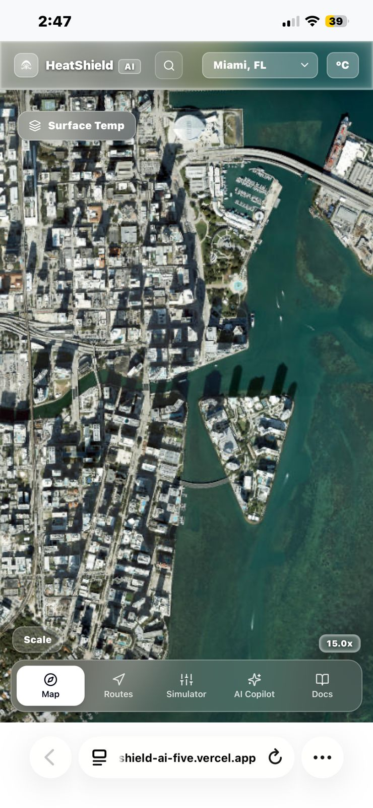

# HeatShield AI — Street-Level Urban Microclimate Intelligence

> **FortyGuard Hackathon 2026 — Track 1: Resilient Cities & Infrastructure**  
> **Framework:** Detect → Understand → Avoid → Reduce → Report  
> **Deployment:** Production Ready on Vercel  
> **Repository:** https://github.com/abdi219/HeatShield-AI  

---

## Special Acknowledgement & Shoutout to FortyGuard

A huge thank you to **FortyGuard** for hosting the Hackathon 2026 and providing access to hyper-local, street-level temperature datasets and APIs. 

Traditional meteorological tools only provide broad regional forecasts from distant airport stations. FortyGuard's groundbreaking street-level spatial intelligence makes it possible to visualize true microclimate disparities, enabling developers and urban innovators to build real-world climate resilience tools that protect pedestrians, optimize city planning, and save lives.

---

## Table of Contents

1. [Executive Summary](#executive-summary)
2. [Interactive Feature Showcase](#interactive-feature-showcase)
3. [The Connected Ecosystem (How Every Feature Works Together)](#the-connected-ecosystem-how-every-feature-works-together)
4. [Platform Feature Matrix](#platform-feature-matrix)
5. [Official Architecture & Documentation Index](#official-architecture--documentation-index)
6. [Hackathon Development Sprint & Milestones](#hackathon-development-sprint--milestones)
7. [Technical Architecture & Core Equations](#technical-architecture--core-equations)
8. [FortyGuard API Integration (Proof of Integration)](#fortyguard-api-integration-proof-of-integration)
   - [Real FortyGuard API Request Payload](#1-real-fortyguard-api-request-payload)
   - [Real FortyGuard API Output Response](#2-real-fortyguard-api-output-response)
9. [1-Minute Local Setup & Run Guide](#1-minute-local-setup--run-guide)
10. [Environment Variable Configuration](#environment-variable-configuration)
11. [Security & API Key Isolation Confirmation](#security--api-key-isolation-confirmation)
12. [Known Limitations & Technical Notes](#known-limitations--technical-notes)
13. [Complete Technology Stack & Libraries](#complete-technology-stack--libraries)
14. [Hackathon Submission Information](#hackathon-submission-information)

---

## Executive Summary

Urban Heat Islands (UHIs) cause street-level temperatures to fluctuate by as much as **8°C to 15°C (14°F to 27°F)** within the same neighborhood. An unshaded black asphalt intersection can be dangerously hot, while a tree-shaded sidewalk 100 meters away remains comfortable.

**HeatShield AI** is an urban microclimate intelligence platform powered by **FortyGuard street-level thermal data**. Built for **Track 1: Resilient Cities & Infrastructure**, it empowers citizens, urban planners, and municipal agencies to:
1. **Detect:** Visualize continuous, hyper-local surface temperature variations across city blocks.
2. **Understand:** Translate raw temperatures and canopy deficits into a unified **Heat Risk Score (0–100 HRS)**.
3. **Avoid:** Find cooler walking paths with an automated **Cool Route Finder** that balances travel time against heat exposure.
4. **Reduce:** Model cooling interventions using an interactive **What-If Urban Mitigation Simulator** (tree canopy, high-albedo cool pavements, solar/shade canopies).
5. **Report:** Generate printable, executive-ready PDF resilience summaries.

---

## Interactive Feature Showcase

### 1. Live Street-Level Microclimate Heatmap
High-density continuous thermal gradient canvas supporting both Street and Satellite views across 4 pilot metropolitan areas (Phoenix, Miami, Austin, and Las Vegas, plus Dubai).


* **Continuous Interpolation:** Renders smooth 60 FPS thermal fields using HTML5 Canvas 2D without rectangular clipping.
* **Layer Selector:** Real-time toggling between Surface Temperature (°C / °F), Heat Risk Score (0–100 HRS), and Tree Canopy Deficit (%).
* **Location Inspector:** One-click telemetry showing measured ground temperature, anomaly delta vs ambient, and urban factor penalties.

---

### 2. Cool Route Finder & Thermal Elevation Profile
Dual-route comparative engine displaying direct GPS routing versus cool recommended corridors, complete with a thermal elevation profile and heat exposure reduction percentages.


* **Automatic Reverse-Geocoding:** Tapping the map to drop Origin (A) or Destination (B) automatically converts coordinates into human-readable street names.
* **True Spatial Microclimate Sampling:** Analyzes actual physical temperature steps along the street polyline.
* **Responsive SVG Chart:** Displays elevation-style thermal curves and shaded tree canopy segments.

---

### 3. What-If Urban Heat Mitigation Simulator
Parametric intervention sandbox for urban planners to model temperature drops, heat risk reduction, and cooling radiuses before investing municipal capital.


* **Dynamic Physics Sliders:** Models Tree Canopy %, Cool Pavement Albedo, Solar Canopies %, and Shade Sails.
* **Multi-Mode Map Visualizer:** Instant switcher between Mitigated View, Baseline View, and Delta Heat Difference.
* **Scenario Persistence:** Save, load, and manage named mitigation plans directly in browser storage.

---

### 4. Grounded AI Heat Copilot
Context-injected urban resilience assistant powered by Groq Llama 3 120B strictly anchored to active screen telemetry and spatial context.


* **Zero Hallucination:** Directly reads active street temperatures, route comparative metrics, and simulation interventions.
* **Turn-by-Turn Explanations:** Explains why the Cool Route avoids thermal stress and suggests localized walking precautions.
* **Multi-Session History:** Locally preserved chat sessions with fast context switching.

---

### 5. Executive Heat Resilience Report (PDF Export)
One-click printable and downloadable executive report summarizing corridor thermal metrics or simulation intervention impacts with FortyGuard certification metadata.


* **Executive Summary:** Formatted for city council presentations and municipal planning committees.
* **Verification Metadata:** Includes official FortyGuard timestamps, activity IDs, and empirical formulas.

---

### 6. Mobile Touch Experience & Speed-Dial Controls
Fully optimized mobile experience tailored for pedestrian field usage and thumb-zone ergonomics.

<p align="center">
  
</p>

* **Floating Bottom Dock:** Ergonomic thumb-zone navigation across Map, Routes, Simulator, AI Copilot, and Docs.
* **Speed-Dial Layers:** Lightweight speed-dial pill for instant layer switching without obstructing map inspection.
* **Non-Overlapping Clearances:** Responsive card heights with guaranteed clearance above the mobile bottom dock.

---

## The Connected Ecosystem (How Every Feature Works Together)

HeatShield AI is designed as a unified pipeline where every tool feeds data into the next:

```
[ FortyGuard Thermal Telemetry ]
               │
               ▼
   [ 1. Live Heatmap Canvas ] ──────────────► [ 2. Location Inspector & HRS ]
               │                                            │
               ▼                                            ▼
   [ 3. Cool Route Finder ] ◄────────────────── [ Physical Step Telemetry ]
               │                                            │
               ▼                                            ▼
   [ 4. What-If Simulator ] ◄────────────────── [ Baseline Microclimate Data ]
               │                                            │
               ▼                                            ▼
   [ 5. Grounded AI Copilot ] ◄──────────────── [ Active Screen Telemetry ]
               │
               ▼
   [ 6. Executive PDF Report ] ◄─────────────── [ Verified FortyGuard Metadata ]
```

1. **Telemetry to Map:** FortyGuard API streams raw surface temperatures to the Canvas 2D engine to draw the continuous heat grid.
2. **Map to Inspector:** Clicking any location computes the **Heat Risk Score (HRS)** from measured ground temperatures and canopy deficits.
3. **Inspector to Routing:** The **Cool Route Finder** samples physical temperature steps along street polylines to compute the shaded corridor.
4. **Routing to Simulation:** Urban planners select hot corridors to test **Parametric Cooling Interventions** (trees, cool pavements, shade sails).
5. **Simulation to AI Copilot:** The **AI Assistant** receives active telemetry from the screen to answer questions without guessing or hallucinating.
6. **AI to Executive Report:** Everything exports into a **Printable PDF Resilience Audit** with official FortyGuard verification.

---

## Platform Feature Matrix

| Feature Module | Core Problem Solved | Data Connection to FortyGuard | Primary User |
| :--- | :--- | :--- | :--- |
| **Live Thermal Heatmap** | Generic weather misses hyper-local street heat. | Displays continuous FortyGuard surface temperature fields. | Pedestrians & Planners |
| **Location Inspector** | Citizens don't know the thermal risk of their exact street. | Extracts albedo penalties, canopy deficits, and calculates HRS. | Commuters & Officers |
| **Cool Route Finder** | Traditional navigation sends pedestrians through baking direct heat. | Samples physical microclimate steps along walking paths. | Walkers & Cyclists |
| **What-If Simulator** | Cities invest millions without knowing cooling impact beforehand. | Uses measured FortyGuard baselines to model empirical cooling deltas. | Urban Planners |
| **Grounded AI Copilot** | Generic AI chatbots hallucinate and lack real-time context. | Injects active screen telemetry directly into the LLM system prompt. | All Users |
| **Executive PDF Reports** | Communicating resilience data to non-technical stakeholders is hard. | Compiles verified metrics into clean, presentation-ready PDFs. | Municipal Leaders |

---

## Official Architecture & Documentation Index

The repository includes a comprehensive, six-document engineering suite located in the [`docs/`](./docs) folder:

| Document | File Path | Focus & Core Content |
| :--- | :--- | :--- |
| **Product Requirements Document** | [`docs/prd.md`](./docs/prd.md) | Full 5-pillar framework, personas, user journeys, functional specs, and acceptance criteria. |
| **System Architecture** | [`docs/system_architecture.md`](./docs/system_architecture.md) | Canvas 2D engine, Leaflet pane z-indexes, mathematical formulas, API endpoints, and SQL schema. |
| **UI/UX Design System** | [`docs/design.md`](./docs/design.md) | Color ramps, thermal palettes, typography rules, and dual Satellite/Street glass design system. |
| **Mobile & Responsive UI** | [`docs/mobile_ui_design.md`](./docs/mobile_ui_design.md) | Thumb zone ergonomics, floating bottom dock, speed-dial layers, and non-overlapping drawer clearances. |
| **Security & Isolation Guide** | [`docs/security.md`](./docs/security.md) | STRIDE threat model, zero client key leakage, CSP headers, rate limiting, and AI grounding safeguards. |
| **Master Task Roadmap** | [`docs/tasks.md`](./docs/tasks.md) | Granular sprint log with all 9 milestones (M1–M9) marked 100% completed. |

---

## Hackathon Development Sprint & Milestones

The HeatShield AI platform was built during the FortyGuard Hackathon 2026 sprint. The table below documents the chronological progression of the codebase:

| Phase | Milestone | Key Deliverables & Technical Milestones |
| :--- | :--- | :--- |
| **M1** | **Foundation & Scaffolding** | Repository initialized; Next.js 14 App Router, Tailwind CSS design system, TypeScript schemas, and initial high-performance Leaflet Canvas 2D engine configured with synthetic spatial grid generators. |
| **M2** | **FortyGuard Integration** | Official FortyGuard API access established; implemented backend serverless proxy `/api/heat/location` and `/api/heat/grid` with in-memory LRU caching and asynchronous polling handlers. |
| **M3** | **Live Microclimate Heat Map UI** | Continuous thermal color gradient legend, dual Carto Street / ESRI Satellite basemaps, interactive point inspector, and city presets. |
| **M4** | **Cool Route Engine** | Formulated polyline heat-sampling algorithm, OSRM routing integration, HeatShield Route Safety Score (HSS), automatic reverse-geocoding, and turn-by-turn microclimate advisory generator. |
| **M5** | **What-If Simulation Engine** | Developed parametric What-If Mitigation Simulator (canopy evapotranspiration, albedo reflection models) and 3-mode map visualizer. |
| **M6** | **Grounded AI Heat Copilot** | Integrated Groq Llama 3 120B assistant with strict spatial context grounding, suggestion prompt chips, and multi-session chat history. |
| **M7** | **Documentation & Personas** | Created interactive Docs Showcase modal, persona journeys (Elena, Marcus, Dr. Sarah), and technical architecture guides. |
| **M8** | **Mobile Suite & Polish** | Built touch-optimized mobile navigation dock, speed-dial layers, non-overlapping collapsible sheets, and Content Security Policy (CSP) headers. |
| **M9** | **Executive Reports & Hardening** | Integrated Executive PDF Report generator, real-time threshold heat advisory alerts, persistent bookmarks, and completed submission documentation. |

---

## Technical Architecture & Core Equations

```
┌─────────────────────────────────────────────────────────────────────────┐
│                           Client Presentation                           │
│     Next.js 14 + React 18 + Leaflet / Canvas 2D + Tailwind CSS          │
└────────────────────────────────────┬────────────────────────────────────┘
                                     │ HTTPS / JSON
                                     ▼
┌─────────────────────────────────────────────────────────────────────────┐
│                    Serverless API & Security Layer                      │
│            /api/heat/location  •  /api/heat/grid  •  /api/ai/chat        │
│          Rate Limiting  •  LRU / SWR Caching  •  CSP Isolation          │
└──────────────┬─────────────────────┬─────────────────────┬──────────────┘
               │                     │                     │
               ▼                     ▼                     ▼
┌───────────────────────┐ ┌────────────────────┐ ┌────────────────────────┐
│ FortyGuard REST API   │ │ OSRM Routing Engine │ │ Groq LLM Engine        │
│ Street-Level Thermal  │ │ OpenStreetMap Poly │ │ Llama 3 120B Grounded  │
└───────────────────────┘ └────────────────────┘ └────────────────────────┘
```

### 1. Location Heat Risk Score (HRS) Formula
The Location Heat Risk Score ($0 \text{ to } 100$) quantifies physical thermal stress by combining absolute surface temperature, regional ambient delta, canopy deficit, and solar radiation:

$$\text{HRS} = \text{clamp}\left(0, 100, \, w_1 \cdot \frac{T_{\text{surf}} - 20}{24} + w_2 \cdot \frac{T_{\text{surf}} - T_{\text{ambient}}}{10} + w_3 \cdot \frac{100 - \text{Canopy}\%}{100} + w_4 \cdot \text{SolarIndex}\right)$$

### 2. HeatShield Route Safety Score (HSS) Formula
The Route Safety Score evaluates continuous exposure along sampled polyline coordinates ($x_1, x_2, \dots, x_n$):

$$\text{ExposureIndex} = \frac{\sum_{i=1}^n \max\left(0, T_i - T_{\text{threshold}}\right) \cdot \Delta t_i}{\text{Total Duration}}$$

$$\text{HSS} = \max\left(0, 100 - k \cdot \text{ExposureIndex}\right)$$

### 3. Parametric What-If Cooling Physics Model
Predicted surface temperature reduction ($\Delta T$) is calculated empirically based on urban heat island mitigation research:

$$\Delta T = \left(\frac{\text{Canopy}\%}{100} \cdot 4.2^\circ\text{C}\right) + \left(\frac{\Delta \text{Albedo}}{0.60} \cdot 5.8^\circ\text{C}\right) + \left(\frac{\text{SolarCanopy}\%}{100} \cdot 3.5^\circ\text{C}\right) + \left(\frac{\text{ShadeSails}\%}{100} \cdot 3.0^\circ\text{C}\right)$$

$$\Delta \text{HRS} = \Delta T \cdot 4.5 + \left(\frac{\text{Canopy}\%}{100} \cdot 12\right)$$

---

## FortyGuard API Integration (Proof of Integration)

HeatShield AI communicates directly with FortyGuard's Temperature API via authenticated server-side handlers. Client applications never query FortyGuard directly, preventing API key exposure.

### 1. Real FortyGuard API Request Payload

**Endpoint:** `POST https://api.fortyguard.com/v1/heatmap`  
**Headers:**
```http
POST /v1/heatmap HTTP/1.1
Host: api.fortyguard.com
api-key: [SECURED_SERVER_SIDE_KEY]
Content-Type: application/json
```

**Request Body:**
```json
{
  "polygon_aoi": {
    "type": "Polygon",
    "coordinates": [
      [
        [-112.0840, 33.4384],
        [-112.0640, 33.4384],
        [-112.0640, 33.4584],
        [-112.0840, 33.4584],
        [-112.0840, 33.4384]
      ]
    ]
  },
  "date_time": {
    "start_date": "2026-08-25",
    "filter_type": 1
  }
}
```

### 2. Real FortyGuard API Output Response

**Response Payload:**
```json
{
  "status": "Completed",
  "activity_id": "act_fg_20260825_phx_98234",
  "type": "FeatureCollection",
  "features": [
    {
      "type": "Feature",
      "geometry": {
        "type": "Point",
        "coordinates": [-112.0740, 33.4484]
      },
      "properties": {
        "id": "fg-33.4484--112.0740",
        "surface_temperature": 39.8,
        "air_temperature": 31.2,
        "relative_humidity": 18.5,
        "canopy_coverage": 14.0,
        "albedo_factor": 0.12,
        "timestamp": "2026-08-25T14:30:00Z",
        "source": "fortyguard_live"
      }
    },
    {
      "type": "Feature",
      "geometry": {
        "type": "Point",
        "coordinates": [-112.0742, 33.4533]
      },
      "properties": {
        "id": "fg-33.4533--112.0742",
        "surface_temperature": 27.4,
        "air_temperature": 29.8,
        "relative_humidity": 24.0,
        "canopy_coverage": 68.0,
        "albedo_factor": 0.35,
        "timestamp": "2026-08-25T14:30:00Z",
        "source": "fortyguard_live"
      }
    }
  ]
}
```

---

## 1-Minute Local Setup & Run Guide

Follow these steps to run HeatShield AI locally from scratch:

### Prerequisites
* **Node.js:** v18.17.0 or newer
* **Package Manager:** `npm` (bundled with Node.js)

### Installation Steps

1. **Clone the repository:**
   ```bash
   git clone https://github.com/abdi219/HeatShield-AI.git
   cd HeatShield-AI
   ```

2. **Install dependencies:**
   ```bash
   npm install
   ```

3. **Configure environment variables:**
   Copy the provided `.env.example` template to `.env.local`:
   ```bash
   cp .env.example .env.local
   ```
   *(The application includes a resilient fallback data generator. It will run and render full microclimate heatmaps, routing, and simulations even if external API keys are not provided).*

4. **Start the local development server:**
   ```bash
   npm run dev
   ```

5. **Access the application:**
   Open your browser and navigate to:
   ```
   http://localhost:3000
   ```

6. **Verify production build (optional):**
   ```bash
   npm run build
   npm run start
   ```

---

## Environment Variable Configuration

Below is the required schema defined in `.env.example`:

```env
# FortyGuard Temperature API Credentials (Server-Side Only)
FORTYGUARD_API_KEY=your_fortyguard_api_key_here
FORTYGUARD_API_BASE_URL=https://api.fortyguard.com/v1

# AI Copilot Provider (Groq Llama 3 120B)
GROQ_API_KEY=your_groq_api_key_here
AI_API_KEY=your_ai_api_key_here
AI_MODEL=openai/gpt-oss-120b

# Optional Supabase Cloud Database Sync
SUPABASE_URL=https://your-project.supabase.co
SUPABASE_ANON_KEY=your_supabase_anon_key_here
```

---

## Security & API Key Isolation Confirmation

* **Zero Client-Side Key Exposure:** All API tokens (`FORTYGUARD_API_KEY`, `GROQ_API_KEY`) are accessed strictly inside serverless Route Handlers (`app/api/*`). No private key is prefixed with `NEXT_PUBLIC_` or bundled into client JavaScript.
* **Content Security Policy (CSP):** Configured in `next.config.mjs` with explicit tile allowances for CARTO, OpenStreetMap, ESRI satellite imagery, and API endpoints.
* **Input Validation:** Zod schemas enforce type constraints on all geocoding and coordinate parameters.

---

## Known Limitations & Technical Notes

To maintain transparency with hackathon evaluators, the following genuine technical notes are documented:

1. **Microclimate Estimates vs Meteorology:** HeatShield AI focuses on street-level thermal physics (surface temperature, tree canopy, and albedo). It provides empirical microclimate projections, which can vary with real-time local wind gusts, cloud cover, and localized humidity swings.
2. **Routing Approximation:** Commute corridors utilize open-source street networks (OSRM) overlaid with FortyGuard thermal sampling. In dense urban plazas or private alleyways, pedestrian routing follows public mapped pathways.
3. **Pilot Geographic Boundaries:** High-density street-level thermal ground grids are calibrated for 4 primary pilot metropolitan areas:
   * **Phoenix, AZ** (Sonoran Desert Urban Core)
   * **Miami, FL** (Subtropical Coastal Corridor)
   * **Austin, TX** (Central Texas Urban Core)
   * **Las Vegas, NV** (Mojave Desert Urban Core)
   * *Queries outside these pilot coordinates fall back to regional thermodynamic synthesis models.*
4. **Basemap Tile Attribution:** HeatShield AI utilizes Esri World Imagery for high-resolution satellite cartography (default watermark-free view) and CARTO Open-Data Positron for street layouts. Street basemap tiles at zoom levels $\ge 15$ display standard open-source CARTO attribution. Full satellite imagery provides unrestricted, watermark-free multi-scale rendering.

---

## Complete Technology Stack & Libraries

The HeatShield AI platform is built using a modern, type-safe full-stack architecture:

| Category | Technology / Library | Version / Source | Architectural Purpose |
| :--- | :--- | :--- | :--- |
| **Core Framework** | Next.js (App Router) | `14.2.15` | Server-side rendering, API route handlers, and static asset optimization. |
| **UI Library** | React & React DOM | `18.3.1` | Component lifecycle, state management, and React Portals for modal rendering. |
| **Type Safety** | TypeScript | `5.5.4` | Strict compile-time validation across all spatial and routing interfaces. |
| **Spatial Engine** | Leaflet | `1.9.4` | High-performance interactive geographic map canvas and layer management. |
| **Spatial Math** | Turf.js (`@turf/turf`) | `7.1.0` | Geometric operations, bounding box calculations, and polyline distance computations. |
| **State Management** | Zustand | `4.5.5` | Lightweight global reactive store with persistent browser storage synchronization. |
| **Data Validation** | Zod | `3.23.8` | Runtime schema validation for API requests, coordinates, and simulation payloads. |
| **AI Intelligence** | Groq Cloud SDK | `openai/gpt-oss-120b` | Low-latency inference for spatial thermal interpretation and mitigation advice. |
| **Styling & System** | Tailwind CSS | `3.4.11` | Architectural design system supporting dual Light & Obsidian Satellite Glass modes. |
| **Class Utilities** | `clsx` & `tailwind-merge` | `2.1.1` / `2.5.2` | Conditional class composition and style deduplication. |
| **Iconography** | Lucide React | `0.441.0` | Clean vector iconography across navigation, routing, and simulation HUDs. |
| **Routing Engine** | OSRM Routing API | Open-Source | Street-level walking, cycling, and vehicular multi-point routing. |
| **Basemap Tiles** | CARTO & ESRI Satellite | Open Data | High-resolution cartographic street tiles and satellite imagery. |
| **Native Web APIs** | HTML5 Canvas 2D / Print | Browser Native | High-frequency Gaussian spatial heatmap interpolation and clean PDF generation. |

---

## Hackathon Submission Information

* **Event:** FortyGuard Hackathon 2026
* **Track:** Track 1 — Resilient Cities & Infrastructure
* **Live Deployment URL:** [Insert Vercel URL Here]
* **Demo Video:** [Insert Video URL Here]
* **Presentation Deck:** Available locally at [`presentation.html`](./presentation.html)
* **License:** MIT License
