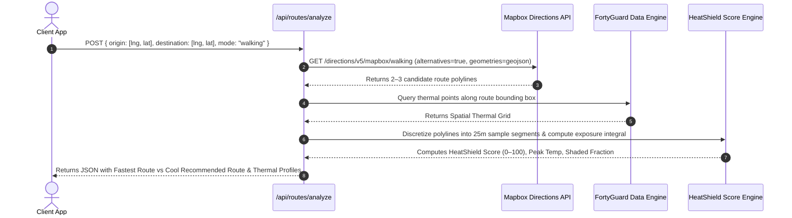

# HeatShield AI — System Architecture & Backend/Database Design

> **Version:** 2.0 (Hackathon Edition)  
> **Core Stack:** Next.js (React 18+ / TypeScript) • Mapbox GL JS • Node.js Serverless API • Supabase (PostgreSQL) • FortyGuard API • Groq / Gemini AI  
> **Deployment Target:** Vercel Serverless Edge Architecture

---

## 1. High-Level System Architecture

HeatShield AI is architected as an event-driven, serverless spatial intelligence platform. It decouples high-frequency map interactions on the client from compute-heavy thermal scoring, external API aggregation, and grounded AI inference on the backend.

```mermaid
flowchart TB
    subgraph Client [Client Application — Next.js / React]
        UI[Interactive UI & Floating HUD]
        MapCanvas[Mapbox GL JS WebGL Canvas]
        StateStore[Zustand Spatial State Store]
        ChartEngine[Thermal Profile Visualizer]
    end

    subgraph EdgeAPI [Serverless API Gateway — Vercel / Next.js API]
        ProxyFortyGuard[/api/heat/grid & /api/heat/points]
        RouteAnalyzer[/api/routes/analyze]
        SimEngine[/api/simulate]
        AIEngine[/api/ai/chat]
    end

    subgraph DataServices [External APIs & AI Layer]
        FortyGuardAPI[(FortyGuard Street-Level Temperature API)]
        MapboxDirections[(Mapbox Directions & Geocoding API)]
        LLMProvider[(Groq Llama 3 / Google Gemini Flash)]
    end

    subgraph Persistence [Database Layer — Supabase PostgreSQL]
        ProfilesTable[(public.profiles)]
        LocationsTable[(public.saved_locations)]
        SimLogsTable[(public.simulation_logs)]
        CacheTable[(public.cached_heat_cells)]
    end

    UI <--> StateStore
    StateStore <--> MapCanvas
    StateStore <--> ChartEngine

    StateStore -->|HTTP / SSE| EdgeAPI

    ProxyFortyGuard <-->|Cached HTTPS| FortyGuardAPI
    ProxyFortyGuard <--> CacheTable
    RouteAnalyzer <-->|Waypoints & Heat Grid| MapboxDirections
    RouteAnalyzer <--> ProxyFortyGuard
    SimEngine <--> SimLogsTable
    AIEngine <-->|Injected Context Stream| LLMProvider
    EdgeAPI <--> ProfilesTable
    EdgeAPI <--> LocationsTable
```

---

## 2. Frontend Architecture

### 2.1 State Management Structure (Zustand Stores)

To ensure high-performance 60 FPS map rendering without unnecessary React re-render cycles, state is partitioned into specialized slices:

```typescript
// 1. Spatial & Heat Layer Store
interface SpatialState {
  viewport: { lat: number; lng: number; zoom: number; pitch: number; bearing: number };
  activeLayer: 'surface_temp' | 'heat_risk' | 'canopy_deficit';
  selectedCoordinate: { lat: number; lng: number } | null;
  selectedLocationData: LocationHeatProfile | null;
  heatGridGeoJSON: GeoJSON.FeatureCollection | null;
  isLoadingHeat: boolean;
  dataSourceStatus: 'live_fortyguard' | 'cached' | 'offline_mock';
  setViewport: (viewport: Partial<SpatialState['viewport']>) => void;
  selectLocation: (coord: { lat: number; lng: number }) => Promise<void>;
}

// 2. Route & Navigation Store
interface RouteState {
  origin: { address: string; lat: number; lng: number } | null;
  destination: { address: string; lat: number; lng: number } | null;
  travelMode: 'walking' | 'cycling' | 'driving';
  routes: {
    fastest: AnalyzedRoute | null;
    recommendedCool: AnalyzedRoute | null;
  };
  activeComparisonIndex: 0 | 1;
  isCalculatingRoute: boolean;
  calculateRoutes: () => Promise<void>;
}

// 3. What-If Simulation Store
interface SimulationState {
  selectedZone: GeoJSON.Polygon | null;
  interventions: {
    treeCanopyCoverage: number;     // 0 - 100%
    coolPavementAlbedo: number;     // 0.1 - 0.7
    solarCanopyCoverage: number;    // 0 - 100%
    shadeStructureDensity: number;  // 0 - 100%
  };
  baselineMetrics: SimulationMetrics | null;
  mitigatedMetrics: SimulationMetrics | null;
  comparisonMode: 'split_slider' | 'side_by_side' | 'delta_overlay';
  runSimulation: () => void;
}
```

---

## 3. Backend Serverless API Architecture

All endpoints reside under `/api/*` and run as lightweight serverless functions with isolated execution environments.

### 3.1 Endpoint Directory

| Endpoint | Method | Purpose | Cache Policy |
|---|---|---|---|
| `/api/heat/grid` | `GET` | Returns FortyGuard temperature grid GeoJSON for a bounding box (`bbox`). | SWR: `s-maxage=300, stale-while-revalidate=600` |
| `/api/heat/location` | `GET` | Fetches street-level reading + calculates Heat Risk Score for specific `lat,lng`. | SWR: `s-maxage=120` |
| `/api/routes/analyze` | `POST` | Fetches candidate routes from Mapbox, samples FortyGuard thermal grid, and calculates HeatShield Scores. | Dynamic / No-Cache |
| `/api/simulate` | `POST` | Calculates empirical temperature delta for specified zone and intervention parameters. | In-memory Memoized |
| `/api/ai/chat` | `POST` | Injects current spatial/route context into prompt and streams response via Server-Sent Events (SSE). | Real-time Streaming |
| `/api/simulations/save`| `POST` | Persists a simulation run to Supabase `simulation_logs`. | Authenticated / Public Demo |

### 3.2 Detailed Route Analyzer Pipeline (`/api/routes/analyze`)



---

## 4. Database Schema (Supabase PostgreSQL DDL)

The database schema is optimized for spatial data persistence, user preferences, and simulation records.

```sql
-- Enable PostGIS extension for spatial queries (if available) or standard UUID generator
CREATE EXTENSION IF NOT EXISTS "uuid-ossp";

-- ==============================================================================
-- 1. PROFILES TABLE (User Roles & Preferences)
-- ==============================================================================
CREATE TABLE public.profiles (
  id UUID PRIMARY KEY REFERENCES auth.users(id) ON DELETE CASCADE,
  email TEXT NOT NULL UNIQUE,
  display_name TEXT,
  role TEXT NOT NULL DEFAULT 'pedestrian'
    CHECK (role IN ('pedestrian', 'planner', 'enterprise', 'judge')),
  preferred_temp_unit TEXT NOT NULL DEFAULT 'celsius'
    CHECK (preferred_temp_unit IN ('celsius', 'fahrenheit')),
  created_at TIMESTAMPTZ NOT NULL DEFAULT TIMEZONE('utc'::text, NOW()),
  updated_at TIMESTAMPTZ NOT NULL DEFAULT TIMEZONE('utc'::text, NOW())
);

-- ==============================================================================
-- 2. SAVED LOCATIONS TABLE (Bookmarked hotspots & transit points)
-- ==============================================================================
CREATE TABLE public.saved_locations (
  id UUID PRIMARY KEY DEFAULT gen_random_uuid(),
  user_id UUID REFERENCES public.profiles(id) ON DELETE CASCADE,
  location_name TEXT NOT NULL,
  address TEXT,
  latitude DOUBLE PRECISION NOT NULL,
  longitude DOUBLE PRECISION NOT NULL,
  alert_threshold_celsius NUMERIC(4,2),
  is_alert_enabled BOOLEAN NOT NULL DEFAULT FALSE,
  created_at TIMESTAMPTZ NOT NULL DEFAULT TIMEZONE('utc'::text, NOW())
);

CREATE INDEX idx_saved_locations_user_id ON public.saved_locations(user_id);
CREATE INDEX idx_saved_locations_coords ON public.saved_locations(latitude, longitude);

-- ==============================================================================
-- 3. SIMULATION LOGS TABLE (Urban heat mitigation scenarios)
-- ==============================================================================
CREATE TABLE public.simulation_logs (
  id UUID PRIMARY KEY DEFAULT gen_random_uuid(),
  user_id UUID REFERENCES public.profiles(id) ON DELETE SET NULL,
  scenario_name TEXT NOT NULL,
  location_name TEXT NOT NULL,
  bounding_box JSONB NOT NULL, -- GeoJSON Bounding Box Polygon
  baseline_temp_celsius NUMERIC(4,2) NOT NULL,
  baseline_heat_risk_score INTEGER NOT NULL CHECK (baseline_heat_risk_score BETWEEN 0 AND 100),
  
  -- Intervention Parameters
  canopy_coverage_pct NUMERIC(4,2) NOT NULL DEFAULT 0.00,
  cool_pavement_albedo NUMERIC(3,2) NOT NULL DEFAULT 0.15,
  solar_canopy_coverage_pct NUMERIC(4,2) NOT NULL DEFAULT 0.00,
  shade_structure_pct NUMERIC(4,2) NOT NULL DEFAULT 0.00,
  
  -- Computed Simulation Outputs
  simulated_temp_reduction NUMERIC(4,2) NOT NULL,
  simulated_heat_risk_score INTEGER NOT NULL CHECK (simulated_heat_risk_score BETWEEN 0 AND 100),
  estimated_cooling_radius_meters INTEGER NOT NULL,
  
  created_at TIMESTAMPTZ NOT NULL DEFAULT TIMEZONE('utc'::text, NOW())
);

CREATE INDEX idx_simulation_logs_user_id ON public.simulation_logs(user_id);
CREATE INDEX idx_simulation_logs_created_at ON public.simulation_logs(created_at DESC);

-- ==============================================================================
-- 4. CACHED HEAT CELLS TABLE (High-performance spatial cache for FortyGuard data)
-- ==============================================================================
CREATE TABLE public.cached_heat_cells (
  cell_id TEXT PRIMARY KEY, -- Geohash or H3 index key
  latitude DOUBLE PRECISION NOT NULL,
  longitude DOUBLE PRECISION NOT NULL,
  surface_temp_celsius NUMERIC(4,2) NOT NULL,
  ambient_temp_celsius NUMERIC(4,2) NOT NULL,
  heat_risk_score INTEGER NOT NULL CHECK (heat_risk_score BETWEEN 0 AND 100),
  source TEXT NOT NULL DEFAULT 'fortyguard_api',
  data_timestamp TIMESTAMPTZ NOT NULL,
  cached_at TIMESTAMPTZ NOT NULL DEFAULT TIMEZONE('utc'::text, NOW())
);

CREATE INDEX idx_cached_heat_cells_coords ON public.cached_heat_cells(latitude, longitude);
CREATE INDEX idx_cached_heat_cells_cached_at ON public.cached_heat_cells(cached_at);

-- ==============================================================================
-- 5. ROW LEVEL SECURITY (RLS) POLICIES
-- ==============================================================================
ALTER TABLE public.profiles ENABLE ROW LEVEL SECURITY;
ALTER TABLE public.saved_locations ENABLE ROW LEVEL SECURITY;
ALTER TABLE public.simulation_logs ENABLE ROW LEVEL SECURITY;
ALTER TABLE public.cached_heat_cells ENABLE ROW LEVEL SECURITY;

-- Public can read cached heat cells (Needed for seamless judge demo)
CREATE POLICY "Public Read Access for Heat Cache"
  ON public.cached_heat_cells FOR SELECT
  USING (true);

-- Public can view saved simulation logs for showcase
CREATE POLICY "Public Read Access for Simulations"
  ON public.simulation_logs FOR SELECT
  USING (true);

-- Authenticated users can insert/update their own records
CREATE POLICY "Users Manage Own Profiles"
  ON public.profiles FOR ALL
  USING (auth.uid() = id);

CREATE POLICY "Users Manage Own Saved Locations"
  ON public.saved_locations FOR ALL
  USING (auth.uid() = user_id);

CREATE POLICY "Users Insert Own Simulations"
  ON public.simulation_logs FOR INSERT
  WITH CHECK (auth.uid() = user_id OR auth.uid() IS NULL);
```

---

## 5. Mathematical Scoring & Simulation Engines

All scores are strictly deterministic, transparent, and derived from physical formulas rather than unverified LLM generation.

### 5.1 Heat Risk Score (HRS) Formula

The **Heat Risk Score** is a location-specific index ($0 \text{--} 100$) answering: *"How acute is the thermal hazard at this exact coordinate?"*

$$HRS = \text{clamp}\left( 0, 100, \, w_1 \cdot T_{\text{norm}} + w_2 \cdot \Delta T_{\text{anomaly}} + w_3 \cdot I_{\text{impervious}} - w_4 \cdot C_{\text{shade}} \right)$$

Where:
- $T_{\text{norm}} = \frac{T_{\text{surface}} - 20^\circ\text{C}}{30^\circ\text{C}} \times 100$ (Normalized surface heat from $20^\circ\text{C}$ to $50^\circ\text{C}$).
- $\Delta T_{\text{anomaly}} = \max(0, T_{\text{surface}} - T_{\text{ambient}}) \times 5.0$ (Thermal mass penalty of unshaded asphalt/concrete).
- $I_{\text{impervious}} = \text{estimated surface heat retention factor } [0, 100]$.
- $C_{\text{shade}} = \text{canopy and vertical building shade index } [0, 100]$.
- Weights: $w_1 = 0.50, \, w_2 = 0.25, \, w_3 = 0.15, \, w_4 = 0.10$.

| Score Range | Category | Color | Actionable Recommendation |
|---|---|---|---|
| **0 – 30** | Low Risk | Cyan | Safe for extended outdoor pedestrian activity. |
| **31 – 60** | Moderate Risk | Amber | Standard urban conditions; seek occasional shade. |
| **61 – 80** | High Risk | Orange | Elevated heat load; avoid prolonged direct sun. |
| **81 – 100** | Extreme Risk | Crimson | Dangerous microclimate; immediate shade routing advised. |

---

### 5.2 HeatShield Score (HSS) Route Exposure Formula

The **HeatShield Score** ($0 \text{--} 100$) evaluates the thermal quality of a pedestrian or commuter route. A score of $100$ represents minimal thermal stress, while $0$ represents extreme heat stress.

Let a route $R$ be partitioned into $N$ segments, each of length $\Delta d_i$ meters, traversed at velocity $v$, with duration $\Delta t_i = \frac{\Delta d_i}{v}$ and sampled temperature $T_i$.

$$\text{Cumulative Exposure Index (CEI)} = \sum_{i=1}^N \max\left(0, T_i - T_{\text{threshold}}\right)^{1.3} \times \left(\frac{\Delta t_i}{60}\right)$$

$$\text{HeatShield Score (HSS)} = \text{clamp}\left(0, 100, \, 100 - \gamma \cdot \frac{\text{CEI}}{\text{Route Duration in Minutes}}\right)$$

Where:
- $T_{\text{threshold}} = 30.0^\circ\text{C}$ (Baseline threshold where thermal stress begins).
- $\gamma = 12.5$ (Scaling calibration constant).
- Non-linear exponent $1.3$ penalizes extreme heat spikes over steady moderate temperatures.

---

### 5.3 What-If Mitigation Physics Model

Simulates the thermal delta $\Delta T_{\text{sim}}$ resulting from urban interventions:

$$\Delta T_{\text{sim}} = \Delta T_{\text{canopy}} + \Delta T_{\text{albedo}} + \Delta T_{\text{solar}} + \Delta T_{\text{shade}}$$

Where empirical cooling factors are derived from urban microclimate literature:
1. **Canopy Evapotranspiration:**
   $$\Delta T_{\text{canopy}} = -1.0 \times \left( \frac{\text{Coverage}_{\%}}{100} \right) \times 4.2^\circ\text{C}$$
2. **Cool Pavement / High Albedo Reflectance:**
   $$\Delta T_{\text{albedo}} = -1.0 \times \left( \frac{\text{Albedo}_{\text{new}} - \text{Albedo}_{\text{base}}}{0.5} \right) \times 5.0^\circ\text{C}$$
3. **Solar PV & Fabric Shade Canopies:**
   $$\Delta T_{\text{solar}} = -1.0 \times \left( \frac{\text{Shade}_{\%}}{100} \right) \times 3.2^\circ\text{C}$$

$$\text{Simulated Surface Temp} = \max\left(T_{\text{ambient}}, \, T_{\text{baseline}} + \Delta T_{\text{sim}}\right)$$

---

## 6. AI Grounding & Context Injection Pipeline

To ensure the AI Heat Assistant never fabricates data or makes unsupported claims, all user queries are processed through a deterministic Context Injection Pipeline.

```
[ User Prompt: "Which route should I take to avoid heat exhaustion?" ]
                              │
                              ▼
        [ System Collects Real-Time Application State ]
        ├─ Origin / Destination: [Austin City Hall -> Public Library]
        ├─ Fastest Route: 14 min, Avg 39.8°C, Peak 43.1°C, HSS: 44
        ├─ Recommended Cool Route: 16 min (+2 min), Avg 32.4°C, Peak 34.9°C, HSS: 86
        ├─ Location Heat Risk Score: 78 (High Risk)
        └─ Active FortyGuard Feed Timestamp: 2026-08-17 14:00 UTC
                              │
                              ▼
        [ Injected Structured Prompt to Groq / Gemini ]
        "You are HeatShield AI Assistant. Analyze the user request using ONLY 
         the injected telemetry below. NEVER fabricate temperatures. 
         Highlight that the Cool Route reduces peak heat exposure by 8.2°C 
         for only a 2-minute travel tradeoff."
                              │
                              ▼
        [ Streamed Markdown Response with Clickable Waypoint Links ]
```

---

## 7. Caching & Performance Optimization

```mermaid
flowchart LR
    Request[Incoming Request] --> EdgeCache{Vercel Edge Cache Valid?}
    EdgeCache -->|HIT (<10ms)| ReturnCache[Return Cached Response]
    EdgeCache -->|MISS| DBLookup{Supabase Cache Cell Fresh?}
    DBLookup -->|HIT (<40ms)| ReturnDB[Return DB Cache & Revalidate Edge]
    DBLookup -->|MISS| APIFetch[Fetch Live FortyGuard API]
    APIFetch --> SaveDB[Update Supabase Cache & Edge]
    SaveDB --> ReturnFresh[Return Fresh Payload]
```

- **Spatial Tile Caching:** Microclimate bounding boxes are cached for 5 minutes (`300s`), preventing redundant external API quota consumption during judging.
- **Client GeoJSON Slicing:** Mapbox loads vector data using geo-tiled bounding boxes to prevent browser memory bloat on large areas.
