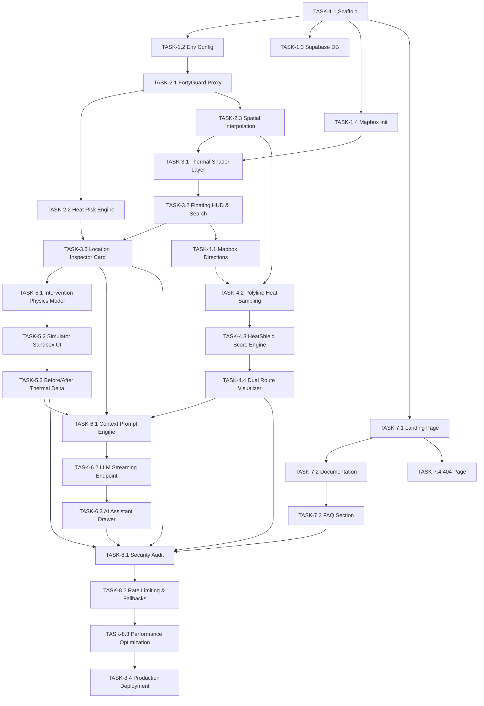

# HeatShield AI — Master Task Breakdown & Implementation Roadmap

> **Target Event:** FortyGuard Hackathon 2026 — Track 1: Resilient Cities & Infrastructure  
> **Development Sprint:** 14-Day Rapid Iteration Cycle  
> **Framework:** Detect → Understand → Avoid → Reduce  
> **Execution Strategy:** Sequential, component-driven development prioritizing a polished, dependable MVP followed by targeted enhancements.

---

## 1. Project Overview & Milestone Index

| Milestone | Focus Area | Timeline | Primary Objective |
|---|---|---|---|
| **M1** | Foundation, Tooling & Core Scaffolding | Days 1–2 | Repo, framework, Mapbox GL JS, Tailwind, Supabase schema, API proxy architecture |
| **M2** | FortyGuard Integration & Spatial Engine | Days 3–4 | Live/mocked FortyGuard API client, spatial grid processing, Heat Risk Score engine |
| **M3** | Live Microclimate Heat Map UI | Days 4–5 | Interactive map HUD, microclimate visual layers, location inspector, heat cards |
| **M4** | Cool Route Finder & HeatShield Score | Days 6–7 | Mapbox Directions, polyline heat-sampling algorithm, HeatShield route comparison engine |
| **M5** | What-If Mitigation Simulator | Days 8–9 | Intervention catalog (canopy, shade, cool roofs), physics-based cooling calculation, delta overlays |
| **M6** | Grounded AI Heat Assistant | Days 10–11 | Context-injected LLM provider (Groq/Gemini), non-hallucinatory prompt engine, chat drawer |
| **M7** | Public Website, Documentation & FAQs | Days 11–12 | Landing page pitch, interactive technical docs, methodology visualizers, 404 page |
| **M8** | Hardening, Security, Performance & Deploy | Days 13–14 | Vercel production deploy, security audit, cross-browser verification, pitch demo assets |
| **M9** | Stretch Features (Post-MVP Buffer) | Stretch | PDF export, email heat alerts, user profile persistence |

---

## 2. Granular Task Breakdown

```
Legend:
[P1] Critical Core MVP  |  [P2] Secondary Polish  |  [P3] Stretch Goal
Frontend (FE)  |  Backend (BE)  |  Spatial/Math (SP)  |  Docs/Design (DD)
```

### Milestone 1: Foundation, Tooling & Project Scaffolding (Days 1–2)

- [x] **TASK-1.1: Project Workspace & Dependency Architecture** `[P1]` `[FE/BE]`
  - Initialize modern web application scaffold (Next.js / Vite + React 18+ TypeScript).
  - Configure Tailwind CSS with bespoke typography and thermal token configuration.
  - Setup Lucide icons, class-variance-authority, clsx, and tailwind-merge.
  - *Acceptance Criteria:* Clean build, strict TypeScript checks enabled, dev server runs without errors.

- [x] **TASK-1.2: Environment Configuration & Secret Management** `[P1]` `[BE]`
  - Create `.env.example` defining `FORTYGUARD_API_KEY`, `FORTYGUARD_API_BASE_URL`, `NEXT_PUBLIC_MAPBOX_TOKEN`, `AI_API_KEY`, `AI_MODEL`, `SUPABASE_URL`, `SUPABASE_ANON_KEY`, `SUPABASE_SERVICE_ROLE_KEY`.
  - Implement environment variable validation utility with Zod schemas to fail fast on missing keys.
  - *Acceptance Criteria:* App logs clear initialization status without leaking keys into browser bundles.

- [x] **TASK-1.3: Supabase Database Setup & Schema Migration** `[P1]` `[BE]`
  - Provision Supabase project.
  - Execute PostgreSQL migrations for `profiles`, `saved_locations`, and `simulation_logs` tables.
  - Configure Row Level Security (RLS) policies allowing public read for demo assets and user-scoped write permissions.
  - *Acceptance Criteria:* Migrations run successfully; test queries verify RLS enforcement.

- [x] **TASK-1.4: Mapbox GL JS Baseline Integration** `[P1]` `[FE]`
  - Setup Mapbox GL JS map canvas component with dark-matter base style.
  - Configure navigation controls, bounding box constraints (U.S. coverage focus), and viewport camera controller.
  - Implement fallback handling for Mapbox WebGL context initialization failures.
  - *Acceptance Criteria:* Smooth 60 FPS rendering of interactive vector map centered on primary demonstration city (e.g., Phoenix / Miami / Austin).

---

### Milestone 2: FortyGuard Integration & Spatial Data Engine (Days 3–4)

- [ ] **TASK-2.1: FortyGuard API Client & Resilient Proxy Layer** `[P1]` `[BE]`
  - Build backend proxy route `/api/heat/points` and `/api/heat/grid` to encapsulate private FortyGuard credentials.
  - Implement HTTP request caching (in-memory LRU / SWR caching) to prevent external rate-limit exhaustion during judging.
  - Create a realistic high-fidelity FortyGuard Mock Generator fallback mode for continuous offline development and test coverage outside supported coordinates.
  - *Acceptance Criteria:* API returns structured GeoJSON feature collections with surface temperature, ambient temperature, humidity, and timestamp metadata.

- [ ] **TASK-2.2: Heat Risk Score (HRS) Mathematical Engine** `[P1]` `[SP]`
  - Formulate deterministic algorithm for Location-Level Heat Risk (0–100):
    $$HRS = w_1 \cdot \text{TempNorm} + w_2 \cdot \text{Anomaly} + w_3 \cdot \text{BuiltFactor} + w_4 \cdot \text{SolarIndex}$$
  - Implement unit tests covering extreme cold, baseline, moderate, high, and extreme heat conditions.
  - *Acceptance Criteria:* Score outputs are consistent, bounded in $[0, 100]$, and fully documented in code.

- [ ] **TASK-2.3: Spatial Point-to-Grid Interpolation & GeoJSON Generation** `[P1]` `[SP]`
  - Implement spatial indexing (KD-Tree / Turf.js / PostGIS) to query temperature points nearest to any coordinate in $<10\text{ms}$.
  - Generate dynamic GeoJSON contour/heat surface layers for visual map rendering.
  - *Acceptance Criteria:* Fast spatial queries $(<15\text{ms})$ over a 10,000-point microclimate dataset.

---

### Milestone 3: Live Microclimate Heat Map UI (Days 4–5)

- [ ] **TASK-3.1: Thermal Surface & Heat Layer Shader Visualization** `[P1]` `[FE]`
  - Create custom Mapbox heatmap/circle/raster layer visualizing street-level microclimate temperature gradients.
  - Use restrained, scientifically intuitive color palette:
    - Cool Safe ($<28^\circ\text{C}$ / $<82^\circ\text{F}$): Muted Cyan / Slate
    - Moderate ($28\text{--}34^\circ\text{C}$ / $82\text{--}93^\circ\text{F}$): Warm Amber / Ochre
    - High Heat ($35\text{--}40^\circ\text{C}$ / $95\text{--}104^\circ\text{F}$): Crimson Coral
    - Extreme ($>40^\circ\text{C}$ / $>104^\circ\text{F}$): Deep Vermilion / Violet
  - *Acceptance Criteria:* Layer transitions smoothly between zoom levels without visual artifacts or frame drops.

- [ ] **TASK-3.2: Floating Glass HUD & Geographic Search Control** `[P1]` `[FE]`
  - Build minimalist top-bar search with Mapbox Geocoding API with autocomplete for US addresses.
  - Implement city quick-switch presets (e.g., Phoenix Downtown, Austin Urban Core, Miami Brickell).
  - Include heat data freshness badge (`Live FortyGuard Feed`, `Cached`, or `Demo Mode`).
  - *Acceptance Criteria:* Selecting a suggestion smoothly flies the camera to the target bounding box and refreshes heat data.

- [ ] **TASK-3.3: Location Heat Risk Inspector Card** `[P1]` `[FE]`
  - Build interactive click/hover inspector panel showing:
    - Exact street-level surface temperature vs regional ambient temperature.
    - Calculated Heat Risk Score with color-coded gauge and contextual risk level badge.
    - Contributing factors breakdown (Surface albedo, vegetation deficit, shade coverage).
  - *Acceptance Criteria:* Clicking any spot on the map opens the inspection panel with verified data.

---

### Milestone 4: Cool Route Finder & HeatShield Score (Days 6–7)

- [ ] **TASK-4.1: Mapbox Directions API Integration** `[P1]` `[FE/BE]`
  - Create route origin and destination selector supporting search, map click, or current location.
  - Query Mapbox Directions API for multiple alternative paths (e.g., pedestrian, cycling, driving).
  - *Acceptance Criteria:* Returns primary fastest route and alternative candidates with geometries and step waypoints.

- [ ] **TASK-4.2: Polyline Heat-Sampling Algorithm** `[P1]` `[SP]`
  - Discretize route polylines into equidistant sampling intervals (e.g., every 25–50 meters).
  - Perform spatial lookup against FortyGuard temperature grid for each sample point.
  - Compute segment-by-segment thermal profile along total route distance.
  - *Acceptance Criteria:* Produces temperature arrays $[(dist_0, temp_0), (dist_1, temp_1), \dots]$ in $<50\text{ms}$.

- [ ] **TASK-4.3: HeatShield Score (HSS) Route Engine** `[P1]` `[SP]`
  - Formulate mathematical route exposure index ($0\text{--}100$ scale, where $100$ represents minimal heat exposure):
    $$\text{Exposure} = \frac{\sum_{i=1}^n (T_i - T_{\text{threshold}})^+ \cdot \Delta t_i}{\text{Total Duration}}$$
    $$\text{HSS} = \max\left(0, 100 - k \cdot \text{Exposure}\right)$$
  - Calculate comparative metrics: $\Delta$ Heat Exposure (%), $\Delta$ Travel Time (min), Maximum Peak Temperature ($^\circ\text{C}$).
  - *Acceptance Criteria:* Formula is deterministic, transparent, and correctly balances duration vs thermal stress.

- [ ] **TASK-4.4: Dual-Route Comparison & Heat Profile Visualizer** `[P1]` `[FE]`
  - Render color-coded route polylines on map (Fastest Route vs Cool Recommended Route).
  - Build interactive route comparison card displaying time, distance, HeatShield Score, and heat exposure reduction.
  - Render interactive thermal elevation profile chart (distance vs temperature with shade highlights).
  - *Acceptance Criteria:* Clicking a route highlights it on map and displays turn-by-turn heat segment advisory.

---

### Milestone 5: What-If Mitigation Simulator (Days 8–9)

- [ ] **TASK-5.1: Intervention Catalog & Parametric Model** `[P1]` `[SP]`
  - Define intervention types and empirical cooling models based on urban heat research:
    1. **Urban Tree Canopy:** $-2.5^\circ\text{C}$ to $-4.0^\circ\text{C}$ local surface cooling via evapotranspiration and shade.
    2. **High-Albedo Cool Pavement / Cool Roofs:** $-3.0^\circ\text{C}$ to $-6.0^\circ\text{C}$ surface temperature reduction.
    3. **Photovoltaic Solar Canopies:** $-2.0^\circ\text{C}$ to $-3.5^\circ\text{C}$ ground shade cooling.
    4. **Tensile Fabric Shade Sails:** $-1.5^\circ\text{C}$ to $-3.0^\circ\text{C}$ localized pedestrian cooling.
  - Implement deterministic calculation engine taking baseline temperature, intervention area ($m^2$), and density ($0\text{--}100\%$).
  - *Acceptance Criteria:* Mathematical model runs instantaneously client-side or via serverless function.

- [ ] **TASK-5.2: Interactive Simulation Sandbox UI** `[P1]` `[FE]`
  - Add bounding box / polygon selector tool on map to designate urban intervention zone.
  - Build simulation configuration dock: slider controls for canopy coverage %, cool pavement albedo, and shade density.
  - Add explicit disclaimer badge: *"Model Estimates & Physics-Based Projections — Not Real-World Guarantees"*.
  - *Acceptance Criteria:* Adjusting sliders immediately triggers live recalculation and updates UI metrics.

- [ ] **TASK-5.3: Before-and-After Thermal Delta Visualization** `[P1]` `[FE]`
  - Render dynamic delta heat map overlay showing predicted cooling zone (cooling thermal contours).
  - Provide interactive split-screen / toggle slider comparing **Baseline** vs **Mitigated** scenario.
  - Present Summary Impact Card: Estimated Average Temp Drop ($\Delta T$), Heat Risk Reduction ($\Delta \text{HRS}$), and Estimated Cooling Radius.
  - *Acceptance Criteria:* Visually stunning, clear comparison without fake graphics or gimmicky neon visuals.

- [ ] **TASK-5.4: Simulation Scenario Saving (Supabase)** `[P2]` `[BE/FE]`
  - Implement backend endpoint `/api/simulations/save` storing scenario parameters in `simulation_logs`.
  - Provide ability to share or reload past simulation benchmarks.
  - *Acceptance Criteria:* Scenarios persist cleanly and load with exact state restored.

---

### Milestone 6: Grounded AI Heat Assistant (Days 10–11)

- [ ] **TASK-6.1: Context Injection Pipeline & System Prompt Architecture** `[P1]` `[BE]`
  - Design strict system prompts enforcing grounded responses:
    - Mandate reference to active FortyGuard measurements, current HRS, selected route stats, or simulation state.
    - Explicitly forbid hallucinating fake temperatures, unverified medical claims, or unsupported regional claims.
    - Require structured formatting with actionable pedestrian or urban planning insights.
  - *Acceptance Criteria:* Automated prompt test harness confirms model refuses to invent unmeasured temperatures.

- [ ] **TASK-6.2: AI Service Integration (Groq / Gemini)** `[P1]` `[BE]`
  - Implement `/api/ai/chat` endpoint using Groq (Llama 3 / Mixtral) or Google Gemini Flash for $<500\text{ms}$ time-to-first-token.
  - Implement Server-Sent Events (SSE) streaming for real-time natural language generation.
  - Build robust fallback handler if external AI API times out or hits rate limits.
  - *Acceptance Criteria:* Instant streaming response with structured markdown formatting.

- [ ] **TASK-6.3: AI Assistant Drawer & Context Pill UI** `[P1]` `[FE]`
  - Build sleek slide-over assistant drawer with glassmorphism styling.
  - Display active context badge (e.g., `Context: Austin Downtown | Route A vs B | Temp: 38.2°C`).
  - Provide 1-click suggested prompts (e.g., *"Why is Route B cooler?"*, *"What intervention works best here?"*, *"Explain this Heat Risk Score"*).
  - *Acceptance Criteria:* Seamless conversation with clickable citation chips highlighting map areas.

---

### Milestone 7: Public Website, Documentation & FAQ (Days 11–12)

- [ ] **TASK-7.1: Modern Landing Page Pitch Experience** `[P1]` `[FE]`
  - Hero section explaining the urban heat island crisis and HeatShield AI's street-level spatial intelligence.
  - Interactive "Before & After / City vs Street" micro-demo component.
  - Clear value proposition cards for Pedestrians, Urban Planners, and Enterprise Managers.
  - "Launch App / Explore Live Demo" primary call-to-action (frictionless, no login required).
  - *Acceptance Criteria:* Pristine visual appeal, responsive layout, adherence to design constraints (no generic AI tropes).

- [ ] **TASK-7.2: Interactive Methodology & Technical Documentation Page** `[P1]` `[FE/DD]`
  - Deep-dive documentation page detailing:
    - FortyGuard API integration architecture.
    - Mathematical formulation of Heat Risk Score and HeatShield Score.
    - What-If simulation physics models and empirical assumptions.
    - System architecture, data flow, and privacy considerations.
  - Include interactive formula explorers and visual diagrams.
  - *Acceptance Criteria:* Complete, authoritative documentation ready for hackathon judges.

- [ ] **TASK-7.3: Comprehensive FAQ Section** `[P1]` `[FE/DD]`
  - Searchable accordion FAQ covering:
    - How FortyGuard street-level data differs from regional weather apps.
    - Geographic coverage limitations (US focus).
    - Explanation of AI grounding and safety limitations.
    - How simulations are calculated.
  - *Acceptance Criteria:* Expandable, keyboard-accessible accordion with rich markdown content.

- [ ] **TASK-7.4: Custom Branded 404 Page** `[P1]` `[FE]`
  - Build custom 404 page adhering to the app's visual identity.
  - Include thermal radar graphic and direct navigation buttons back to the map or landing page.
  - *Acceptance Criteria:* Handles invalid routes cleanly without breaking app layout.

---

### Milestone 8: Hardening, Security, Performance & Production Deploy (Days 13–14)

- [ ] **TASK-8.1: Security & API Key Isolation Audit** `[P1]` `[BE]`
  - Verify all external API calls (FortyGuard, AI LLMs, Supabase Service Role) happen exclusively on serverless backend.
  - Audit client bundle to ensure zero secret leakage in production JS files.
  - Add security headers (Content-Security-Policy, X-Content-Type-Options, Strict-Transport-Security).
  - *Acceptance Criteria:* Security checklist 100% passed; secret scanners return 0 alerts.

- [ ] **TASK-8.2: Rate Limiting & Error Boundary Resilience** `[P1]` `[BE/FE]`
  - Configure IP-based rate limiting on serverless endpoints.
  - Implement React Error Boundaries and friendly fallback states for:
    - Unsupported geographic coordinates.
    - FortyGuard API downtime or 5xx responses.
    - Mapbox network failures.
    - AI service rate-limit / timeout.
  - *Acceptance Criteria:* App never crashes to blank white screen under simulated network failures.

- [ ] **TASK-8.3: Performance & Lighthouse Optimization** `[P1]` `[FE]`
  - Code-split heavy components (Mapbox GL, Chart.js / Recharts, AI Assistant).
  - Optimize asset loading and web fonts with `next/font` / font-display swap.
  - Target Lighthouse scores: Performance $\ge 90$, Accessibility $\ge 95$, Best Practices $\ge 95$, SEO $\ge 95$.
  - *Acceptance Criteria:* Initial load under 1.5s on standard 4G connection.

- [ ] **TASK-8.4: Vercel Production Deployment & Demo Verification** `[P1]` `[BE/FE]`
  - Deploy to Vercel production environment with custom domain / clean preview URL.
  - Run end-to-end smoke test in Incognito across Chrome, Firefox, Safari, and Edge.
  - Verify demo flow: Search $\rightarrow$ Microclimate Map $\rightarrow$ Heat Risk Score $\rightarrow$ Cool Route comparison $\rightarrow$ What-If Simulator $\rightarrow$ AI Assistant $\rightarrow$ Docs.
  - *Acceptance Criteria:* Flawless live deployment accessible worldwide without login barriers.

---

### Milestone 9: Stretch Features (Post-MVP Buffer)

- [ ] **TASK-9.1: Downloadable Spatial Heat Report** `[P3]` `[FE/BE]`
  - Generate structured summary PDF or printable HTML report containing location heat analysis, route comparison, and simulation findings.
- [ ] **TASK-9.2: Threshold Heat Alerts System** `[P3]` `[BE/FE]`
  - Allow users to save locations and configure temperature threshold triggers with local browser notifications.
- [ ] **TASK-9.3: Supabase User Profile & Bookmarking** `[P3]` `[FE/BE]`
  - Optional OAuth login allowing urban planners to save custom simulated scenarios and bookmark frequent commuting corridors.

---

## 3. Implementation Order & Dependencies


