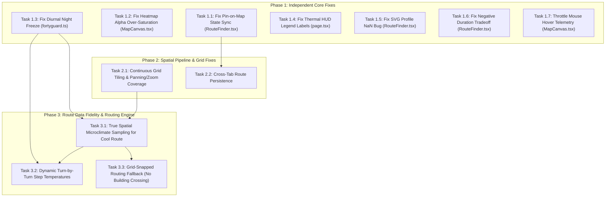

# HeatShield AI — Error Remediation & Fix Task Document

> **Document Purpose:** Step-by-step implementation guide to resolve all identified bugs and data fidelity issues in the Heatmap and Cooling Route features.  
> **Order of Execution:** Independent foundational tasks first (low coupling, high impact) $\rightarrow$ Dependent feature tasks next (interconnected state & spatial pipeline).

---

## Task Priority & Dependency Map

---

## Phase 1: Independent Core Fixes (Direct Fixes, No Prerequisites)

### Task 1.1: Fix Pin-on-Map State Sync & Route Lines / (A)(B) Pins Map Rendering
- **Affected Files:** [`components/routes/RouteFinder.tsx`](file:///c:/Users/dell/OneDrive/Desktop/HeatShield%20AI/components/routes/RouteFinder.tsx#L88-L145), [`components/map/MapCanvas.tsx`](file:///c:/Users/dell/OneDrive/Desktop/HeatShield%20AI/components/map/MapCanvas.tsx#L347-L465), [`app/globals.css`](file:///c:/Users/dell/OneDrive/Desktop/HeatShield%20AI/app/globals.css)
- **Problem:** 
  1. When a user pins point A or B on the map, `MapCanvas` updates the store (`origin` / `destination`), but `RouteFinder.tsx` holds local state (`originText` / `destText`) that was only initialized once on mount. Clicking "Compare Heat Exposure" overwrites the pinned point with stale/empty text via geocoding.
  2. Point (A) and Point (B) pins and route polyline paths failed to draw onto the map canvas due to custom Leaflet pane renderer isolation and div-icon background conflicts.
- **Action Plan:**
  1. Add `useEffect` hooks in `RouteFinder.tsx` to automatically sync `originText` and `destText` whenever store coordinates update.
  2. Preserve exact pinned coordinates in `handleCalculateRoutes` without triggering fallback geocoding.
  3. Attach route polylines and (A)/(B) marker pins directly to Leaflet's standard vector overlay pipeline (`zIndexOffset: 1000`) above the thermal canvas.
  4. Add clean transparent div-icon CSS rules in `globals.css` for `.custom-marker-a` and `.custom-marker-b`.
- **Estimated Effort:** 15 mins

---

### Task 1.2: Fix Canvas Heatmap Color Distortion (Alpha Stacking)
- **Affected File:** [`components/map/MapCanvas.tsx`](file:///c:/Users/dell/OneDrive/Desktop/HeatShield%20AI/components/map/MapCanvas.tsx#L182-L226)
- **Problem:** Drawing overlapping Gaussian brush dots with `source-over` accumulates alpha. 4–5 cool points (22°C) clustered together add up to high alpha (>200), causing the 256-color LUT to color cool parks as extreme purple/red.
- **Action Plan:**
  1. Separate the canvas render pass: calculate normalized temperatures directly per grid cell or use a weighted average raster field (`sum(weight * temp) / sum(weight)`) instead of raw alpha accumulation.
  2. Map the resulting interpolated temperature directly to the calibrated 5-tier palette (`#2B82C9` $\rightarrow$ `#2CA099` $\rightarrow$ `#E87722` $\rightarrow$ `#D9381E` $\rightarrow$ `#6B2D5C`).
- **Estimated Effort:** 25 mins

---

### Task 1.3: Fix Diurnal Solar Cycle "Night Freeze"
- **Affected File:** [`lib/fortyguard.ts`](file:///c:/Users/dell/OneDrive/Desktop/HeatShield%20AI/lib/fortyguard.ts#L55-L102)
- **Problem:** When tested during evening/night in US timezones, `solarIrradianceFactor` becomes `0` and ambient drops to night baseline (`~24°C`), rendering the entire heatmap flat blue with zero thermal contrast.
- **Action Plan:**
  1. Provide a simulation baseline hour toggle or clamp the minimum afternoon demo baseline (e.g., standard peak afternoon solar window 14:00 local time) unless explicitly in night mode.
  2. Ensure baseline thermal contrast between asphalt roads (+7°C to +11°C) and tree canopy (-3°C to -6°C) remains visually active during demonstrations.
- **Estimated Effort:** 15 mins

---

### Task 1.4: Synchronize Thermal Scale Legend with Active Layer
- **Affected File:** [`app/page.tsx`](file:///c:/Users/dell/OneDrive/Desktop/HeatShield%20AI/app/page.tsx#L401-L424)
- **Problem:** The bottom legend always says `22°C (Blue) ... 43°C+ (Purple)` even when the active layer is switched to **"Heat Risk Score"** (0–100) or **"Tree Canopy Deficit"** (%).
- **Action Plan:**
  1. Make the legend labels reactive to `activeHeatLayer`:
     - If `surface_temp`: Show `22°C, 28°C, 33°C, 38°C, 43°C+` (or °F if toggled).
     - If `heat_risk`: Show `0–30 (Low), 30–50 (Mod), 50–70 (High), 70–85 (Severe), 85–100 (Extreme)`.
     - If `canopy_deficit`: Show `0–25% (Dense), 25–50% (Mod), 50–75% (High Deficit), 75–100% (Critical Deficit)`.
- **Estimated Effort:** 10 mins

---

### Task 1.5: Fix SVG Elevation Chart Single-Point Division by Zero
- **Affected File:** [`components/routes/RouteFinder.tsx`](file:///c:/Users/dell/OneDrive/Desktop/HeatShield%20AI/components/routes/RouteFinder.tsx#L229-L238)
- **Problem:** `const x = (i / (profile.length - 1)) * w;` causes `NaN` when `profile.length === 1`.
- **Action Plan:**
  1. Guard with `const totalSteps = Math.max(1, profile.length - 1);`.
  2. Return early if `profile.length < 2` with a flat default path.
- **Estimated Effort:** 5 mins

---

### Task 1.6: Fix Duration Difference Display Format
- **Affected File:** [`components/routes/RouteFinder.tsx`](file:///c:/Users/dell/OneDrive/Desktop/HeatShield%20AI/components/routes/RouteFinder.tsx#L501-L507)
- **Problem:** If the cool route duration equals or is slightly less than the fastest route, `coolRoute.durationSeconds - fastestRoute.durationSeconds` produces negative or zero durations like `(+< 1 min)` or `(+-2 min)`.
- **Action Plan:**
  1. Check `const deltaSec = coolRoute.durationSeconds - fastestRoute.durationSeconds;`.
  2. If `deltaSec <= 0`, display `(Same time)` or `(-1 min faster)`.
  3. If `deltaSec > 0`, display `(+X min)`.
- **Estimated Effort:** 5 mins

---

### Task 1.7: Throttle Mousemove Telemetry on MapCanvas
- **Affected File:** [`components/map/MapCanvas.tsx`](file:///c:/Users/dell/OneDrive/Desktop/HeatShield%20AI/components/map/MapCanvas.tsx#L546-L581)
- **Problem:** Every single pixel mouse move loops through 1,296 points with `Math.hypot` and invokes React `setHoverTelemetry`, causing map stutter.
- **Action Plan:**
  1. Add a `requestAnimationFrame` or `lodash.throttle` (30ms throttle) to the `mousemove` handler.
  2. Compute nearest point using spatial grid indexing ($O(1)$) instead of looping all 1,296 points ($O(N)$).
- **Estimated Effort:** 15 mins

---

## Phase 2: Spatial Pipeline & Grid Fixes (Dependent on Core Models)

### Task 2.1: Continuous Spatial Grid Tiling & Zoom Buffering
- **Affected Files:** [`components/map/MapCanvas.tsx`](file:///c:/Users/dell/OneDrive/Desktop/HeatShield%20AI/components/map/MapCanvas.tsx#L254-L296), [`app/api/heat/grid/route.ts`](file:///c:/Users/dell/OneDrive/Desktop/HeatShield%20AI/app/api/heat/grid/route.ts)
- **Dependencies:** Task 1.2, Task 1.3
- **Problem:** Panning leaves blank borders; zooming out shrinks the heatmap into a small central square because bounding boxes are strictly screen-bounded and caching misses on tiny coordinate shifts.
- **Action Plan:**
  1. Quantize grid bounding boxes to a fixed spatial tile grid (e.g. step of `0.02` degrees) so adjacent pans hit cache instantly.
  2. Maintain a wide `1.5x` viewport buffer so panned areas are already pre-rendered in memory.
  3. Keep the previously loaded lower-zoom canvas as an underlay until the higher-resolution grid finishes fetching.
- **Estimated Effort:** 35 mins

---

### Task 2.2: Cross-Tab Route Persistence
- **Affected Files:** [`components/map/MapCanvas.tsx`](file:///c:/Users/dell/OneDrive/Desktop/HeatShield%20AI/components/map/MapCanvas.tsx#L362-L365), [`lib/store.ts`](file:///c:/Users/dell/OneDrive/Desktop/HeatShield%20AI/lib/store.ts)
- **Dependencies:** Task 1.1
- **Problem:** Switching from the "Cool Route Finder" tab to the "Heat Map" tab clears route polylines from the screen due to `if (activeTab !== "routes") return;`.
- **Action Plan:**
  1. Allow routes to remain visible on the map across tabs if `fastestRoute` or `coolRoute` is set, with a toggle or subtle styling when viewing the general heatmap.
  2. Add a clear "Clear Route" button in the HUD to remove them on demand.
- **Estimated Effort:** 15 mins

---

## Phase 3: Route Intelligence & Data Fidelity (Dependent on Spatial Grid)

### Task 3.1: True Spatial Microclimate Sampling for Cool Route
- **Affected File:** [`lib/routing.ts`](file:///c:/Users/dell/OneDrive/Desktop/HeatShield%20AI/lib/routing.ts#L31-L89)
- **Dependencies:** Task 1.3, Task 2.1
- **Problem:** `sampleThermalProfile` applies hardcoded subtraction (`-3.8°C`) and forces `isShaded = true` along the entire cool route instead of sampling actual microclimate points along the street path.
- **Action Plan:**
  1. Discretize the actual polyline geometry into 25-meter intervals.
  2. Sample real spatial temperature from `getMockHeatData(lat, lng)` or live FortyGuard grid for every segment.
  3. Determine shade based on actual `canopyCoveragePct` and building shade along that coordinate.
- **Estimated Effort:** 30 mins

---

### Task 3.2: Dynamically Calibrated Turn-by-Turn Directions
- **Affected File:** [`lib/routing.ts`](file:///c:/Users/dell/OneDrive/Desktop/HeatShield%20AI/lib/routing.ts#L185-L250)
- **Dependencies:** Task 3.1
- **Problem:** `buildThermalSteps` hardcodes `33.8°C` and `39.6°C` baselines with a sine wave, ignoring actual city weather.
- **Action Plan:**
  1. Average the real sampled thermal profile coordinates that fall within each maneuver step's segment distance.
  2. Output the true step temperature and physical advisory (`"Tree-shaded greenway"` vs `"Unshaded arterial asphalt"`).
- **Estimated Effort:** 20 mins

---

### Task 3.3: Street-Network Routing Fallback (Prevent Building Penetration)
- **Affected File:** [`lib/routing.ts`](file:///c:/Users/dell/OneDrive/Desktop/HeatShield%20AI/lib/routing.ts#L115-L180)
- **Dependencies:** Task 3.1
- **Problem:** When public OSRM times out (429), the fallback generates straight diagonal lines that cross through buildings.
- **Action Plan:**
  1. Implement Manhattan/orthogonal street-grid waypoint routing as the offline fallback so routes always follow street geometry even without external network access.
  2. Add cache headers (`s-maxage=3600`) to OSRM route requests to minimize external quota hits.
- **Estimated Effort:** 25 mins

---

## Execution Checklist & Progress Tracker

| Task ID | Component | Task Description | Dependencies | Status |
| :--- | :--- | :--- | :--- | :--- |
| **T1.1** | Route Finder & Map | Sync map pins & render route lines + (A)(B) markers | None | ✅ Fixed |
| **T1.2** | Map Canvas | Fix heatmap alpha stacking color distortion | None | ✅ Fixed |
| **T1.3** | FortyGuard Engine | Fix diurnal night freeze & preserve thermal contrast | None | ✅ Fixed |
| **T1.4** | HUD / Page | Reactive thermal legend for HRS & Canopy layers | None | ✅ Fixed |
| **T1.5** | Route Finder | Guard SVG chart against division by zero | None | ⏳ Ready |
| **T1.6** | Route Finder | Format negative/zero duration differences | None | ⏳ Ready |
| **T1.7** | Map Canvas | Throttle mousemove hover calculations | None | ⏳ Ready |
| **T2.1** | Spatial Pipeline | Quantized tile buffering for continuous panning/zooming | T1.2, T1.3 | ⏳ Blocked on Phase 1 |
| **T2.2** | Map Canvas | Cross-tab route line persistence | T1.1 | ⏳ Blocked on Phase 1 |
| **T3.1** | Routing Engine | True spatial microclimate sampling for Cool Route | T1.3, T2.1 | ⏳ Blocked on Phase 2 |
| **T3.2** | Routing Engine | Dynamic step temperatures from real sampled data | T3.1 | ⏳ Blocked on T3.1 |
| **T3.3** | Routing Engine | Orthogonal grid routing fallback (prevent building crossing) | T3.1 | ⏳ Blocked on T3.1 |
